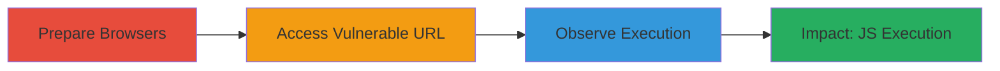

---
tags:
  - xss
  - reflected-xss
  - wordpress
  - plupload
  - flash
  - javascript-injection
type: attack_chain
tools:
  - '[[tools/Google-Chrome]]'
  - '[[tools/Mozilla-Firefox]]'
tactics:
  - '[[Initial Access]]'
  - '[[Execution]]'
  - '[[Collection]]'
verified: false
platforms:
  - Web
submitted: true
complexity: low
created_at: '2023-10-01T00:00:00Z'
procedures:
  - '[[procedures/Prepare-Browsers-for-XSS-Testing]]'
  - '[[procedures/Access-Plupload-Flash-Vulnerable-URL]]'
  - '[[procedures/Observe-XSS-Payload-Execution]]'
step_count: 3
techniques:
  - '[[Exploit Public-Facing Application]]'
  - '[[JavaScript]]'
updated_at: '2025-12-14T03:16:07.878Z'
description: >-
  A multi-step attack chain exploiting a reflected XSS vulnerability in an
  outdated Plupload Flash SWF file on a WordPress site, allowing arbitrary
  JavaScript execution in the victim's browser.
skill_level: beginner
impact_level: high
id: 6057546f-18c9-4b4e-b96f-fb714a96bdaf
validated: true
mitre_tactics:
  - '[[Initial Access]]'
  - '[[Execution]]'
  - '[[Collection]]'
mitre_techniques:
  - '[[Exploit Public-Facing Application]]'
  - '[[JavaScript]]'
---
# Reflected XSS via Plupload Flash SWF in WordPress

Multi-stage attack chain demonstrating exploitation of a reflected XSS vulnerability in the Plupload Flash SWF file on a WordPress-based site, such as business-blog.zomato.com, due to an outdated Plupload version. The attack involves injecting JavaScript via specially encoded URL parameters, leading to arbitrary code execution in the browser.

## Chain Metrics Dashboard

| Metric | Value |
|--------|-------|
| Chain Status | Unverified |
| Total Steps | 3 |
| Execution Time | ~1 minutes |
| Skill Level | Beginner |
| Complexity | Low |
| Impact Level | High |

## Attack Flow Visualization

## Prerequisites & Requirements

### Required Tools

- [[tools/Google-Chrome]]
- [[tools/Mozilla-Firefox]]

### Target Environment

- Web platform with WordPress
- Outdated Plupload version (pre-latest release)
- Flash-enabled SWF file at /wp-includes/js/plupload/plupload.flash.swf
- No specific ports or services beyond standard HTTP/HTTPS

### Initial Access Requirements

- Direct network access to the target site (e.g., business-blog.zomato.com)
- No credentials required
- Victim must access the crafted URL in a modern browser

## Detailed Attack Procedures

### Step 1: Prepare Browsers for XSS Testing
procedure: [[procedures/Prepare-Browsers-for-XSS-Testing]]

**Objective**: Set up testing environment using modern browsers to verify cross-browser payload execution.

**Instructions**: Launch the latest versions of Chrome and Firefox to prepare for accessing the vulnerable endpoint.

**Expected Output**: Browsers open and ready for navigation.

**Success Indicators**:
- Chrome and Firefox launched successfully
- Browser versions confirmed as latest

### Step 2: Access Vulnerable URL
procedure: [[procedures/Access-Plupload-Flash-Vulnerable-URL]]

**Objective**: Deliver the XSS payload by navigating to the specially crafted URL that injects JavaScript into the Flash SWF parameters.

**Instructions**: In each browser, navigate to the URL https://business-blog.zomato.com/wp-includes/js/plupload/plupload.flash.swf?target%g=alert&uid%g=hello&.

**Expected Output**: The SWF file loads with injected parameters.

**Success Indicators**:
- URL accessed without errors
- Flash file begins loading in the browser

### Step 3: Observe Payload Execution
procedure: [[procedures/Observe-XSS-Payload-Execution]]

**Objective**: Confirm arbitrary JavaScript execution, such as an alert popup, indicating successful XSS exploitation.

**Instructions**: Monitor the browser for immediate execution of the injected 'alert' JavaScript upon SWF loading.

**Expected Output**: Alert dialog with 'hello' or similar message appears.

**Success Indicators**:
- JavaScript alert triggers
- No blocking by browser security features

## Attack Chain Summary

### Key Achievements

1. Identified and exploited outdated Plupload Flash vulnerability in WordPress
2. Achieved reflected XSS leading to arbitrary JS execution in Chrome and Firefox
3. Demonstrated potential for session hijacking or data theft without further exploitation

## Technique & Tactic Coverage

### MITRE ATT&CK Techniques

- [[Exploit Public-Facing Application]]
- [[JavaScript]]

### MITRE ATT&CK Tactics

- [[Initial Access]]
- [[Execution]]
- [[Collection]]

---
*Last updated: 2023-10-01T00:00:00Z*
