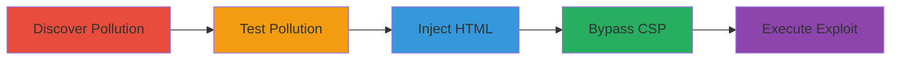

---
tags:
  - xss
  - prototype-pollution
  - csp-bypass
  - reflected-xss
type: attack_chain
tools:
  - '[[tools/Browser-Console]]'
  - '[[tools/AngularJS]]'
  - '[[tools/Wistia-Embed-Script]]'
  - '[[tools/Browser]]'
tactics:
  - '[[Initial Access]]'
  - '[[Execution]]'
commands:
  - '[[commands/check-object-prototype]]'
platforms:
  - Web
complexity: medium
procedures:
  - '[[procedures/Discover-Prototype-Pollution-in-Wistia-Script]]'
  - '[[procedures/Test-Prototype-Pollution]]'
  - '[[procedures/Exploit-Pollution-for-HTML-Injection]]'
  - '[[procedures/Bypass-CSP-with-AngularJS]]'
  - '[[procedures/Execute-Full-XSS-Exploit]]'
step_count: 5
techniques:
  - '[[Exploit Public-Facing Application]]'
  - '[[JavaScript]]'
description: >-
  Multi-stage attack exploiting reflected XSS through prototype pollution in
  Wistia video embed script on www.hackerone.com, leading to CSP bypass and
  arbitrary JavaScript execution.
skill_level: intermediate
impact_level: high
id: b4211861-b6a3-4b1f-a02a-a1e56a438a53
created_at: '2025-12-13T23:56:20.404Z'
updated_at: '2025-12-13T23:56:20.404Z'
verified: false
validated: true
submitted: true
mitre_tactics:
  - '[[Initial Access]]'
  - '[[Execution]]'
mitre_techniques:
  - '[[Exploit Public-Facing Application]]'
  - '[[JavaScript]]'
---
# Reflected XSS via Prototype Pollution in Wistia Embed on HackerOne

Multi-stage attack chain demonstrating a complete attack workflow.

## Chain Metrics Dashboard

| Metric | Value |
|--------|-------|
| Chain Status | Unverified |
| Total Steps | 5 |
| Execution Time | ~10 minutes |
| Skill Level | Intermediate |
| Complexity | Medium |
| Impact Level | High |

## Attack Flow Visualization



## Prerequisites & Requirements

### Required Tools

- [[tools/Browser-Console]]
- [[tools/AngularJS]]
- [[tools/Wistia-Embed-Script]]
- [[tools/Browser]]

### Target Environment

- Web platform
- Services: Wistia, Drupal
- Tech Stack: JavaScript, AngularJS

### Initial Access Requirements

- Access to a web browser
- Ability to visit URLs on www.hackerone.com
- No prior credentials needed

## Detailed Attack Procedures

### Step 1: Discover Prototype Pollution in Wistia Script
procedure: [[procedures/Discover-Prototype-Pollution-in-Wistia-Script]]

**Objective**: Analyze the Wistia script to identify prototype pollution vulnerability via URL parsing.

**Instructions**: Analyze the E-v1.js script where i.url.parse(location.href) and i.url.parse(document.referrer) can be manipulated. Use [[commands/check-object-prototype]] in the browser console to inspect:

```javascript
Object.prototype
```

**Expected Output**: Identification of manipulable URL parsing leading to prototype pollution.

**Success Indicators**:
- Vulnerability in URL parsing confirmed
- Potential for adding properties to Object.prototype identified

### Step 2: Test Prototype Pollution
procedure: [[procedures/Test-Prototype-Pollution]]

**Objective**: Verify the prototype pollution by visiting a crafted URL and checking the Object prototype.

**Instructions**: Visit a URL like https://www.hackerone.com/blog/scaling-security-startup-unicorn?__proto__[ggg]=aaa. Then use [[commands/check-object-prototype]] in the browser console:

```javascript
Object.prototype
```

**Expected Output**: Object prototype with added property 'ggg'.

**Success Indicators**:
- New property 'ggg' appears in Object.prototype
- Pollution confirmed

### Step 3: Exploit Pollution for HTML Injection
procedure: [[procedures/Exploit-Pollution-for-HTML-Injection]]

**Objective**: Use prototype pollution to inject arbitrary HTML via 'innerHTML' property.

**Instructions**: Add 'innerHTML' property via prototype pollution, which is set on elements created by elem.fromObject during embed initialization, injecting an iframe with srcdoc.

**Expected Output**: Malicious HTML elements inserted into the page.

**Success Indicators**:
- Iframe injected successfully
- HTML injection verified in page source

### Step 4: Bypass CSP with AngularJS
procedure: [[procedures/Bypass-CSP-with-AngularJS]]

**Objective**: Load AngularJS in the injected iframe to bypass CSP and execute JavaScript.

**Instructions**: In the iframe srcdoc, load AngularJS from *.cloudflare.com using ng-on-error to execute code like alert(document.domain).

**Expected Output**: JavaScript execution within the iframe, bypassing CSP.

**Success Indicators**:
- Alert or code execution occurs
- CSP bypass confirmed

### Step 5: Execute Full XSS Exploit
procedure: [[procedures/Execute-Full-XSS-Exploit]]

**Objective**: Combine all steps to execute the full exploit via a crafted URL.

**Instructions**: Visit https://www.hackerone.com/blog/scaling-security-startup-unicorn with query parameters polluting prototype with innerHTML containing iframe srcdoc loading AngularJS and executing payload.

**Expected Output**: Animated images and domain displayed, indicating successful XSS.

**Success Indicators**:
- Payload executes fully
- Potential for phishing or further exploitation demonstrated

## Attack Chain Summary

### Key Achievements

1. Discovery and confirmation of prototype pollution
2. HTML injection leading to iframe creation
3. CSP bypass enabling JavaScript execution

## Technique & Tactic Coverage

### MITRE ATT&CK Techniques

- [[Exploit Public-Facing Application]]
- [[JavaScript]]

### MITRE ATT&CK Tactics

- [[Initial Access]]
- [[Execution]]

*Last updated: 2023-10-01*
