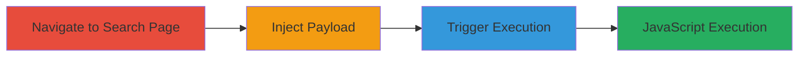

---
tags:
  - xss
  - javascript
  - web
  - client-side
type: attack_chain
tools:
  - '[[tools/Firefox]]'
tactics:
  - '[[Execution]]'
verified: false
platforms:
  - Web
submitted: true
complexity: medium
created_at: '2023-10-01T00:00:00Z'
procedures:
  - '[[procedures/Navigate-to-Search-Results-Page]]'
  - '[[procedures/Inject-XSS-Payload-into-Search-Field]]'
  - '[[procedures/Trigger-XSS-Payload-Execution]]'
step_count: 3
techniques:
  - '[[JavaScript]]'
updated_at: '2025-12-14T03:15:53.294Z'
description: >-
  A multi-step attack exploiting a reflected XSS vulnerability in the search
  functionality of Khan Academy's smarthistory subdomain, allowing arbitrary
  JavaScript execution in the victim's browser.
skill_level: intermediate
impact_level: high
id: a3981647-a880-4826-ad67-906edd2a66b4
validated: true
mitre_tactics:
  - '[[Execution]]'
mitre_techniques:
  - '[[JavaScript]]'
---
# Reflected XSS via Search Input on smarthistory.khanacademy.org

Multi-stage attack chain demonstrating a complete client-side JavaScript injection workflow via a reflected XSS vulnerability in the search feature.

## Chain Metrics Dashboard

| Metric | Value |
|--------|-------|
| Chain Status | Unverified |
| Total Steps | 3 |
| Execution Time | ~2 minutes |
| Skill Level | Intermediate |
| Complexity | Medium |
| Impact Level | High |

## Attack Flow Visualization

## Prerequisites & Requirements

### Required Tools

- [[tools/Firefox]]

### Target Environment

- Web platform
- Access to http://smarthistory.khanacademy.org/search-results.html
- No specific services or ports required beyond standard HTTP/80

### Initial Access Requirements

- No credentials needed
- Direct network access to the public-facing website
- No prior access required

## Detailed Attack Procedures

### Step 1: Navigate to Search Results Page
procedure: [[procedures/Navigate-to-Search-Results-Page]]

**Objective**: Access the vulnerable search functionality page to prepare for payload injection.

**Instructions**: Open [[tools/Firefox]] and navigate to the target URL http://smarthistory.khanacademy.org/search-results.html. This loads the page with the search input field.

**Expected Output**: The search results page loads successfully, displaying the search bar.

**Success Indicators**:
- Page loads without errors
- Search input field is visible and interactive

### Step 2: Inject XSS Payload into Search Field
procedure: [[procedures/Inject-XSS-Payload-into-Search-Field]]

**Objective**: Introduce malicious JavaScript via the search input to reflect unsanitized content back into the page.

**Instructions**: In the search input field, enter the payload `<input onfocus=alert(1) autofocus>` or the discovered variant `" onclick="alert(1)"`. Submit the search to reflect the input.

**Expected Output**: Search results page reloads with the injected payload reflected in the DOM, but not yet executed.

**Success Indicators**:
- Payload appears in the page source or DOM
- No immediate errors or sanitization blocks the input

### Step 3: Trigger XSS Payload Execution
procedure: [[procedures/Trigger-XSS-Payload-Execution]]

**Objective**: Interact with the page to cause the reflected payload to execute arbitrary JavaScript.

**Instructions**: After the search submission, click back on the search bar to refocus it. This triggers the onclick or onfocus event in the payload.

**Expected Output**: An alert popup displays with "1", confirming JavaScript execution.

**Success Indicators**:
- Alert box appears
- Browser console shows no blocking errors
- Potential for further payloads to steal session data

## Attack Chain Summary

### Key Achievements

1. Successful navigation to the vulnerable endpoint
2. Injection and reflection of XSS payload without sanitization
3. Execution of arbitrary JavaScript, enabling session hijacking or data theft

## Technique & Tactic Coverage

### MITRE ATT&CK Techniques

- [[JavaScript]]

### MITRE ATT&CK Tactics

- [[Execution]]

---

*Last updated: 2023-10-01T00:00:00Z*
