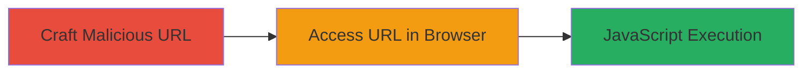

---
tags:
  - xss
  - reflected-xss
  - javascript
  - informatica
  - stack-trace
type: attack_chain
tools:
  - '[[tools/Internet-Explorer]]'
  - '[[tools/Mozilla-Firefox]]'
tactics:
  - '[[Initial Access]]'
  - '[[Execution]]'
verified: false
platforms:
  - Web
submitted: true
complexity: low
created_at: '2023-10-01T00:00:00Z'
procedures:
  - '[[procedures/Craft-Malicious-URL-for-Reflected-XSS]]'
  - '[[procedures/Trigger-XSS-via-Browser-Access]]'
step_count: 2
techniques:
  - '[[JavaScript]]'
  - '[[Drive-by Compromise]]'
updated_at: '2025-12-14T03:16:08.301Z'
description: >-
  A multi-step attack exploiting a reflected XSS vulnerability in the
  Informatica documentation server by injecting a JavaScript payload into the
  navigation path, triggering a server error that reflects the payload
  unsanitized, leading to arbitrary JavaScript execution in the victim's
  browser.
skill_level: beginner
impact_level: high
id: 84ae50b2-b6eb-407c-8d75-61c8d666529a
validated: true
mitre_tactics:
  - '[[Initial Access]]'
  - '[[Execution]]'
mitre_techniques:
  - '[[JavaScript]]'
  - '[[Drive-by Compromise]]'
---
# Reflected XSS via Stack Trace Exposure in Informatica Documentation Server

Multi-stage attack chain demonstrating a complete attack workflow exploiting a reflected XSS vulnerability in the Informatica documentation server.

## Chain Metrics Dashboard

| Metric | Value |
|--------|-------|
| Chain Status | Unverified |
| Total Steps | 2 |
| Execution Time | ~1 minute |
| Skill Level | Beginner |
| Complexity | Low |
| Impact Level | High |

## Attack Flow Visualization



## Prerequisites & Requirements

### Required Tools

- [[tools/Internet-Explorer]]
- [[tools/Mozilla-Firefox]]

### Target Environment

- Web platform
- Informatica documentation server (e.g., doc.rt.informaticacloud.com)
- Vulnerable versions of ActiveVOS documentation (v92 or similar)
- No specific ports required beyond standard HTTP/HTTPS (80/443)

### Initial Access Requirements

- Public access to the documentation server
- No credentials needed
- Victim must visit the crafted URL (e.g., via phishing or direct link)

## Detailed Attack Procedures

### Step 1: Craft Malicious URL
procedure: [[procedures/Craft-Malicious-URL-for-Reflected-XSS]]

**Objective**: Create a URL with an injected XSS payload in the navigation path to trigger a NumberFormatException and reflect the payload in the error stack trace.

**Instructions**: Append a JavaScript payload to a valid navigation path segment, such as '7_1_2_3_2_1', in the URL structure of the Informatica doc server. Use a payload like '<svg/onload=alert(document.domain)>' which is compact and executes on load.

Example crafted URL:

```url
http://doc.rt.informaticacloud.com/infocenter/ActiveVOS/v92/nav/7_1_2_3_2_1<svg/onload=alert(document.domain)>
```

**Expected Output**: A valid-looking URL that, when accessed, causes server-side parsing failure.

**Success Indicators**:
- URL is formed without syntax errors
- Payload is embedded in the path without URL encoding issues

### Step 2: Trigger XSS via Browser Access
procedure: [[procedures/Trigger-XSS-via-Browser-Access]]

**Objective**: Visit the malicious URL in a vulnerable browser to receive the HTTP 500 error page, where the unsanitized stack trace reflects and executes the injected JavaScript.

**Instructions**: Open the crafted URL in Internet Explorer or Mozilla Firefox. The server will attempt to parse the path as an integer, fail, and return an HTTP 500 response with the full stack trace including the payload. The browser renders this as HTML, executing the script.

No specific commands needed; simply navigate to the URL in the browser.

**Expected Output**: An alert popup displaying the document domain (e.g., 'doc.rt.informaticacloud.com'), confirming JavaScript execution.

**Success Indicators**:
- HTTP 500 error page loads with stack trace visible
- JavaScript alert triggers, indicating arbitrary code execution
- No blocking by browser security features in vulnerable versions

## Attack Chain Summary

### Key Achievements

1. Successful injection of XSS payload into navigation path
2. Triggering of server-side error to reflect unsanitized input
3. Achievement of arbitrary JavaScript execution for potential session theft or phishing

## Technique & Tactic Coverage

### MITRE ATT&CK Techniques

- [[JavaScript]]
- [[Drive-by Compromise]]

### MITRE ATT&CK Tactics

- [[Initial Access]]
- [[Execution]]

---

*Last updated: 2023-10-01T00:00:00Z*
