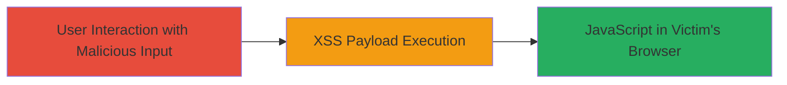

---
tags:
  - xss
  - reflected-xss
  - swagger-ui
  - javascript-execution
type: attack_chain
tools: []
tactics:
  - '[[Execution]]'
commands:
  - '[[commands/curl-xss-payload-test]]'
platforms:
  - Web
complexity: medium
procedures:
  - '[[procedures/Exploit-Reflected-XSS-in-Swagger-UI]]'
step_count: 1
techniques:
  - '[[JavaScript]]'
  - '[[Exploit Public-Facing Application]]'
description: >-
  A single-stage attack exploiting a reflected XSS vulnerability in Swagger UI
  to execute arbitrary JavaScript in the victim's browser, potentially leading
  to session hijacking or data theft.
skill_level: intermediate
impact_level: medium
id: 8f60c2b6-4239-46cd-aac0-470c2db6472d
created_at: '2025-12-14T00:11:16.060Z'
updated_at: '2025-12-14T00:11:16.060Z'
verified: false
validated: true
submitted: true
mitre_tactics:
  - '[[Execution]]'
mitre_techniques:
  - '[[JavaScript]]'
  - '[[Exploit Public-Facing Application]]'
---
# Reflected XSS via Swagger UI for JavaScript Execution

## Overview

This attack chain demonstrates exploiting a reflected Cross-Site Scripting (XSS) vulnerability in the Swagger UI interface of an Adobe application. The vulnerability arises from insufficient input sanitization in user-controlled parameters displayed in the UI, allowing attackers to inject and execute malicious JavaScript in the context of a victim's browser. Discovered on August 1, 2022, and publicly disclosed on October 25, 2022, this medium-severity issue (CVSS 6.1) enables potential session hijacking, data theft, or phishing when a victim interacts with a crafted malicious link or form input. The attack requires no authentication and targets public-facing web applications using Swagger UI.

## Chain Metrics Dashboard

| Metric | Value |
|--------|-------|
| Chain Status | Unverified |
| Total Steps | 1 |
| Execution Time | ~5 minutes |
| Skill Level | Intermediate |
| Complexity | Medium |
| Impact Level | Medium |

## Attack Flow Visualization



## Prerequisites & Requirements

### Required Tools

- Web browser for testing and delivery

### Target Environment

- Web platform with Swagger UI exposed
- No specific ports required (typically HTTP/HTTPS on 80/443)
- Public access to the Swagger UI endpoint

### Initial Access Requirements

- No credentials needed
- Attacker must convince victim to interact with the malicious input (e.g., via phishing link)
- Network access to the target application

## Detailed Attack Procedures

### Step 1: Deliver and Execute XSS Payload
procedure: [[procedures/Exploit-Reflected-XSS-in-Swagger-UI]]

**Objective**: Inject a malicious JavaScript payload into a reflected parameter in Swagger UI to execute arbitrary code in the victim's browser context.

**Instructions**: Identify a vulnerable input field or URL parameter in the Swagger UI (e.g., a search or query parameter that reflects user input without sanitization). Craft a payload such as `<script>alert('XSS')</script>` and encode it for URL delivery. Test the payload using [[commands/curl-xss-payload-test]] to verify reflection:

```bash
curl -X GET "https://target.example.com/swagger-ui/?param=%3Cscript%3Ealert('XSS')%3C/script%3E" -v
```

Once confirmed, deliver the malicious URL to the victim via email, social engineering, or a phishing site. When the victim accesses the Swagger UI with the tainted parameter, the payload executes.

**Expected Output**: The reflected payload appears in the browser, triggering JavaScript execution (e.g., an alert box or network request for exfiltration).

**Success Indicators**:
- Payload reflects unsanitized in the UI source
- JavaScript executes (e.g., console logs or alerts)
- Victim's session cookies or data can be stolen via follow-on scripts

## Attack Chain Summary

### Key Achievements

1. Successful injection and reflection of XSS payload in Swagger UI
2. Arbitrary JavaScript execution in victim browser context
3. Potential for session hijacking or data exfiltration

## Technique & Tactic Coverage

### MITRE ATT&CK Techniques

- [[JavaScript]]
- [[Exploit Public-Facing Application]]

### MITRE ATT&CK Tactics

- [[Execution]]

---
*Last updated: 2024-01-01*
