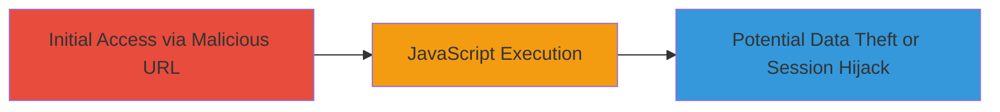

# Reflected XSS via URL Path Injection on All Pages

Multi-stage attack chain demonstrating a complete attack workflow.

## Chain Metrics Dashboard

| Metric | Value |
|--------|-------|
| Chain Status | Unverified |
| Total Steps | 1 |
| Execution Time | ~1 minute |
| Skill Level | Beginner |
| Complexity | Low |
| Impact Level | High |

## Attack Flow Visualization



## Prerequisites & Requirements

### Required Tools

- Web browser (e.g., Chrome, Firefox)

### Target Environment

- Web application (e.g., https://vikingco.com)
- No specific services/ports required beyond HTTP/HTTPS access
- Publicly accessible website

### Initial Access Requirements

- No credentials needed
- Direct network access to the target website
- No prior access required

## Detailed Attack Procedures

### Step 1: Inject XSS Payload via URL Path
procedure: [[procedures/Exploit-Reflected-XSS-via-URL-Path]]

**Objective**: Craft and load a malicious URL that injects JavaScript into the site's script tag, executing arbitrary code in the victim's browser.

**Instructions**: Open a web browser and navigate to the target website. Modify the URL path to include the XSS payload that closes the existing script tag and injects a new one. For example, append the payload to a page path like /en/home/:

Use the following URL structure:

```url
https://vikingco.com/en/home/tttttt</script><script>alert(0)</script>
```

Replace 'tttttt' with any filler text if needed. Load the URL in the browser to trigger the payload.

**Expected Output**: An alert box pops up displaying '0', confirming JavaScript execution.

**Success Indicators**:
- Alert box appears in the browser
- Browser console shows no errors, and the injected script executes
- Potential for further payloads to steal cookies or session data

## Attack Chain Summary

### Key Achievements

1. Successful injection of arbitrary JavaScript via reflected URL path
2. Demonstration of client-side code execution leading to potential session hijacking
3. Identification of unescaped reflection in script tags across all pages

## Technique & Tactic Coverage

### MITRE ATT&CK Techniques

- [[JavaScript]]

### MITRE ATT&CK Tactics

- [[Execution]]

---

*Last updated: 2023-10-01T12:00:00Z*
