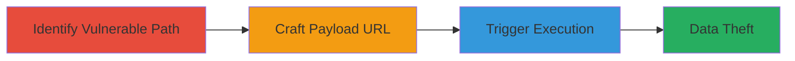

# Reflected XSS via URL Path Suffix Injection on smarthistory.khanacademy.org

Multi-stage attack chain demonstrating a complete reflected XSS workflow on the smarthistory.khanacademy.org subdomain.

## Chain Metrics Dashboard

| Metric | Value |
|--------|-------|
| Chain Status | Unverified |
| Total Steps | 3 |
| Execution Time | ~5 minutes |
| Skill Level | Intermediate |
| Complexity | Medium |
| Impact Level | High |

## Attack Flow Visualization

## Prerequisites & Requirements

### Required Tools

- Web browser (e.g., Chrome, Firefox)
- Optional: Proxy tool like Burp Suite for URL manipulation

### Target Environment

- Web platform
- Access to http://smarthistory.khanacademy.org/
- No specific ports or services beyond HTTP/HTTPS

### Initial Access Requirements

- Public internet access to the target subdomain
- No credentials required for initial identification and testing
- Victim must access the malicious URL (e.g., via phishing)

## Detailed Attack Procedures

### Step 1: Identify Vulnerable URL Path
procedure: [[procedures/Identify-Vulnerable-URL-Path-on-smarthistory-khanacademy-org]]

**Objective**: Discover the lack of sanitization in the URL path suffix, enabling injection points after legitimate paths.

**Instructions**: Navigate to legitimate pages on smarthistory.khanacademy.org, such as http://smarthistory.khanacademy.org/Campin, and inspect the URL structure. Test by appending special characters like ">" to observe if the site reflects unsanitized input in the response.

**Expected Output**: The page renders without proper encoding, showing potential breakout from HTML context.

**Success Indicators**:
- Unsanitized path suffix reflected in HTML output
- No error or redirection on malformed URLs

### Step 2: Craft Malicious XSS Payload URL
procedure: [[procedures/Craft-Malicious-XSS-Payload-URL]]

**Objective**: Construct a proof-of-concept URL that injects and executes JavaScript by breaking out of the expected path context.

**Instructions**: Build the payload by appending a closing quote, script tag, and alert to a legitimate path, e.g., http://smarthistory.khanacademy.org/Campin">.html. Use a text editor or browser URL bar to encode if needed, ensuring the payload evades basic filters.

**Expected Output**: A valid URL that, when parsed, injects the script tag into the HTML.

**Success Indicators**:
- Payload syntax breaks out of quotes or tags
- URL is accessible without 404 errors

### Step 3: Trigger XSS by Accessing Malicious URL
procedure: [[procedures/Trigger-XSS-by-Accessing-Malicious-URL]]

**Objective**: Execute the injected JavaScript in the victim's browser context to demonstrate code execution and potential data theft.

**Instructions**: Open the crafted URL in a web browser. Observe the alert popup confirming execution. In a real attack, replace alert with code to steal cookies, e.g., document.cookie.

**Expected Output**: JavaScript alert or console log executes, proving arbitrary code runs.

**Success Indicators**:
- Alert box or script output appears
- Browser console shows no errors; payload executes

## Attack Chain Summary

### Key Achievements

1. Identified unsanitized URL path suffix for injection
2. Crafted executable XSS payload without server-side validation
3. Demonstrated client-side JavaScript execution for data exfiltration

## Technique & Tactic Coverage

### MITRE ATT&CK Techniques

- [[JavaScript]]

### MITRE ATT&CK Tactics

- [[Execution]]
- [[Collection]]

---
*Last updated: 2023-10-01T00:00:00Z*
