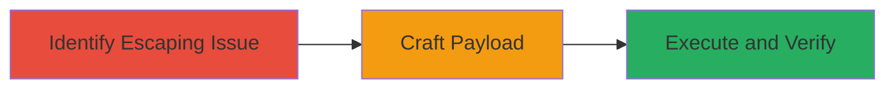

# Reflected XSS via Unescaped Image ID in Uzbey Album Script

Multi-stage attack chain demonstrating the exploitation of a reflected Cross-Site Scripting (XSS) vulnerability in the Uzbey album script, where user-controlled image IDs are not properly escaped, allowing attackers to inject HTML and JavaScript into the page.

## Chain Metrics Dashboard

| Metric | Value |
|--------|-------|
| Chain Status | Unverified |
| Total Steps | 3 |
| Execution Time | ~5 minutes |
| Skill Level | Intermediate |
| Complexity | Low |
| Impact Level | Medium |

## Attack Flow Visualization



## Prerequisites & Requirements

### Required Tools

- Browser (e.g., Firefox for bypassing auditors)

### Target Environment

- Web application: Uzbey album script
- Endpoint: /album/image/{album_id}/{image_id}
- Required services/ports: HTTP/HTTPS on port 80/443
- Network access requirements: Direct access to the staging or production URL

### Initial Access Requirements

- No credentials required
- Publicly accessible web application
- No prior access needed

## Detailed Attack Procedures

### Step 1: Identify Insufficient Escaping
procedure: [[procedures/Exploit-Reflected-XSS-in-Uzbey-Album-Image]]

**Objective**: Analyze the album image endpoint to identify lack of escaping in the image ID parameter, enabling attribute breakout.

**Instructions**: Access the album image URL, such as https://staging.uzbey.com/album/image/679/1139, and inspect the HTML output in the browser developer tools. Observe how the image ID is directly inserted into an HTML attribute without escaping double quotes.

**Expected Output**: HTML source shows unescaped user input in attributes, e.g., 

**Success Indicators**:
- Double quotes in ID parameter are reflected without escaping
- Potential for attribute context breakout confirmed

### Step 2: Craft and Test PoC Payload
procedure: [[procedures/Exploit-Reflected-XSS-in-Uzbey-Album-Image]]

**Objective**: Construct a proof-of-concept payload to break out of the HTML attribute and inject malicious HTML/JavaScript.

**Instructions**: Append an encoded payload to the image ID in the URL, such as https://staging.uzbey.com/album/image/679/1139%22%3E%3Ch1%3ESurprise!%3Cimg%20src=0%20onerror=%22alert(document.domain)%22%3E. Use URL encoding for the payload: %22%3E%3Ch1%3ESurprise!%3Cimg%20src=0%20onerror=%22alert(document.domain)%22%3E. Load the URL in a browser and check for injection.

To simulate via command line for verification, use [[commands/curl-xss-payload]]:

```bash
curl -G "https://staging.uzbey.com/album/image/679/1139%22%3E%3Ch1%3ESurprise!%3Cimg%20src=0%20onerror=%22alert(document.domain)%22%3E" -o response.html
```

Then inspect response.html for injected content.

**Expected Output**: Page renders <h1>Surprise!</h1> and triggers JavaScript execution.

**Success Indicators**:
- HTML injection visible in page source
- JavaScript payload reflected without sanitization

### Step 3: Verify Execution in Compatible Browser
procedure: [[procedures/Exploit-Reflected-XSS-in-Uzbey-Album-Image]]

**Objective**: Confirm arbitrary JavaScript execution by testing in a browser that bypasses XSS auditors.

**Instructions**: Load the crafted URL in Firefox, as it allows execution without blocking by built-in auditors (unlike IE or Chrome). Observe the alert popup displaying the document domain.

**Expected Output**: Alert box pops up showing the domain, e.g., "staging.uzbey.com".

**Success Indicators**:
- JavaScript alert executes successfully
- No blocking by browser security features

## Attack Chain Summary

### Key Achievements

1. Identified unescaped double quotes in image ID parameter
2. Injected HTML and JavaScript via URL manipulation
3. Demonstrated code execution in victim browser context

## Technique & Tactic Coverage

### MITRE ATT&CK Techniques

- [[Exploit Public-Facing Application]]
- [[JavaScript]]

### MITRE ATT&CK Tactics

- [[Initial Access]]
- [[Execution]]

---
*Last updated: 2023-10-01T00:00:00Z*
