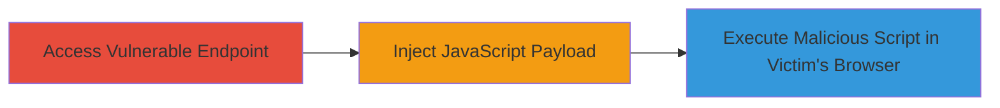

---
tags:
  - xss
  - reflected-xss
  - javascript-injection
  - session-hijacking
type: attack_chain
tools: []
tactics:
  - '[[Execution]]'
verified: false
platforms:
  - Web
submitted: true
complexity: medium
created_at: '2023-10-01T00:00:00Z'
procedures:
  - '[[procedures/Exploit-Reflected-XSS-via-ct-Parameter]]'
step_count: 1
techniques:
  - '[[JavaScript]]'
updated_at: '2025-12-14T03:15:41.807Z'
description: >-
  A single-stage attack exploiting a reflected Cross-Site Scripting (XSS)
  vulnerability in the 'ct' parameter of the unsubRevert.php endpoint on
  card.starbucks.com.sg, allowing arbitrary JavaScript execution in the victim's
  browser for potential session hijacking or data theft.
skill_level: intermediate
impact_level: medium
id: bf72feff-15a4-4dfb-a6d8-fd60370860d0
validated: true
mitre_tactics:
  - '[[Execution]]'
mitre_techniques:
  - '[[JavaScript]]'
---
# Reflected XSS via Unsanitized 'ct' Parameter in Starbucks Card Unsubscribe Revert Endpoint

Multi-stage attack chain demonstrating a complete attack workflow.

## Chain Metrics Dashboard

| Metric | Value |
|--------|-------|
| Chain Status | Unverified |
| Total Steps | 1 |
| Execution Time | ~5 minutes |
| Skill Level | Intermediate |
| Complexity | Medium |
| Impact Level | Medium |

## Attack Flow Visualization



## Prerequisites & Requirements

### Required Tools

- Browser developer tools for payload testing

### Target Environment

- Web platform
- PHP-based web application
- Publicly accessible HTTPS endpoint

### Initial Access Requirements

- Ability to send HTTP requests to the target URL
- Victim interaction required (e.g., clicking a malicious link)
- No prior credentials needed

## Detailed Attack Procedures

### Step 1: Exploit Reflected XSS
procedure: [[procedures/Exploit-Reflected-XSS-via-ct-Parameter]]

**Objective**: Inject and execute arbitrary JavaScript in the context of the victim's browser session by exploiting the unsanitized 'ct' parameter, potentially leading to session token theft or phishing.

**Instructions**: Construct a malicious URL with a JavaScript payload in the 'ct' parameter and trick the victim into accessing it. For testing, use [[commands/curl-xss-test]] to verify reflection:

```bash
curl "https://card.starbucks.com.sg/unsubRevert.php?ct=%3Cscript%3Ealert('XSS')%3C/script%3E" -v
```

Observe the response for payload reflection without sanitization. In a real attack, encode the payload to evade filters and deliver via phishing email or social engineering.

**Expected Output**: The server reflects the input directly in the HTML response, allowing script execution when loaded in a browser.

**Success Indicators**:
- Payload appears unescaped in the response body
- Alert or other JS behavior triggers in the browser
- Potential cookie or session data accessible via executed script

## Attack Chain Summary

### Key Achievements

1. Identified unsanitized 'ct' parameter in unsubRevert.php
2. Injected and executed arbitrary JavaScript in victim context
3. Enabled potential session hijacking or data exfiltration

## Technique & Tactic Coverage

### MITRE ATT&CK Techniques

- [[JavaScript]]

### MITRE ATT&CK Tactics

- [[Execution]]

---
*Last updated: 2023-10-01T00:00:00Z*
