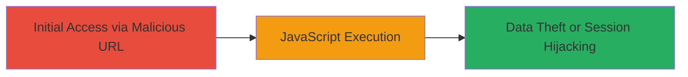

# Reflected XSS via Unsanitized 404 Error Page on U.S. Department of Defense Website

Multi-stage attack chain demonstrating a complete attack workflow.

## Chain Metrics Dashboard

| Metric | Value |
|--------|-------|
| Chain Status | Unverified |
| Total Steps | 1 |
| Execution Time | ~1 minute |
| Skill Level | Beginner |
| Complexity | Low |
| Impact Level | High |

## Attack Flow Visualization



## Prerequisites & Requirements

### Required Tools

- Web browser (e.g., Chrome, Firefox)

### Target Environment

- Target: https://█████████ (U.S. Department of Defense website)
- Required services/ports: HTTP/HTTPS on port 80/443
- Network access requirements: Direct internet access to the target domain

### Initial Access Requirements

- No credentials required
- Victim must visit the crafted malicious URL (e.g., via phishing or direct link)
- No prior access needed

## Detailed Attack Procedures

### Step 1: Deliver and Execute XSS Payload
procedure: [[procedures/Exploit-Reflected-XSS-in-404-Error-Page]]

**Objective**: Inject and execute arbitrary JavaScript in the victim's browser by crafting a URL with a non-existent path containing an XSS payload, leveraging the unsanitized reflection in the 404 error page.

**Instructions**: Construct a malicious URL by appending a payload to a non-existent path on the target domain, such as `/<svg onload=alert('XSS')>`. Direct the victim to visit this URL in their browser. The server will return a 404 error that echoes the path unsanitized, rendering the SVG tag and triggering the onload JavaScript execution.

For testing, you can use a browser to visit the URL directly or simulate with curl to verify reflection (though execution requires rendering):

```bash
curl -i "https://█████████/<svg onload=alert('XSS')>"
```

**Expected Output**: The response includes the 404 page with the injected path reflected as `<svg onload=alert('XSS')>`, which renders and executes in the browser, popping an alert or performing other actions.

**Success Indicators**:
- JavaScript alert or payload executes in the browser
- Reflected payload visible in the 404 error message source
- Potential for cookie theft or session hijacking if payload is adapted (e.g., to exfiltrate document.cookie)

## Attack Chain Summary

### Key Achievements

1. Successful injection of HTML/JavaScript via reflected user input in 404 page
2. Arbitrary code execution in victim browser context
3. Potential for client-side attacks like data exfiltration or phishing

## Technique & Tactic Coverage

### MITRE ATT&CK Techniques

- [[Exploit Public-Facing Application]]
- [[JavaScript]]

### MITRE ATT&CK Tactics

- [[Execution]]
- [[Collection]]

---
*Last updated: 2023-10-01T00:00:00Z*
