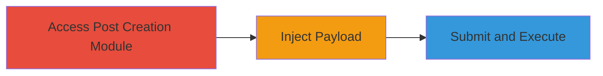

---
tags:
  - xss
  - reflected-xss
  - wordpress
  - mainwp
  - self-xss
type: attack_chain
tools: []
tactics:
  - '[[Execution]]'
verified: false
platforms:
  - Web
  - WordPress
submitted: true
complexity: low
created_at: '2023-10-01T00:00:00Z'
procedures:
  - '[[procedures/Access-MainWP-Post-Creation-Module]]'
  - '[[procedures/Inject-Malicious-JavaScript-in-Category-Name]]'
  - '[[procedures/Submit-Form-and-Observe-Payload-Execution]]'
step_count: 3
techniques:
  - '[[JavaScript]]'
updated_at: '2025-12-14T17:28:36.327Z'
description: >-
  A multi-step attack exploiting a reflected XSS vulnerability in the MainWP
  WordPress plugin's 'Create Category' feature, allowing JavaScript execution in
  the attacker's browser session.
skill_level: beginner
impact_level: low
id: b108e99c-be1e-43e5-8131-73d2c06286b2
validated: true
mitre_tactics:
  - '[[Execution]]'
mitre_techniques:
  - '[[JavaScript]]'
---
# Reflected XSS via Unsanitized Category Name in MainWP Post Creation Module

Multi-stage attack chain demonstrating exploitation of a reflected Cross-Site Scripting (XSS) vulnerability in the MainWP WordPress plugin's post creation module, specifically in the 'Create Category' feature. The attack involves injecting a malicious JavaScript payload into the Category Name field, which is reflected unsanitized in the HTML response, leading to execution in the attacker's browser. While limited to self-XSS (affecting only the attacker's session), it exposes risks in input handling that could chain with other vulnerabilities to impact admin interfaces managing multiple WordPress sites.

## Chain Metrics Dashboard

| Metric | Value |
|--------|-------|
| Chain Status | Unverified |
| Total Steps | 3 |
| Execution Time | ~1 minutes |
| Skill Level | Beginner |
| Complexity | Low |
| Impact Level | Low |

## Attack Flow Visualization

## Prerequisites & Requirements

### Required Tools

- Web browser (e.g., Chrome, Firefox)

### Target Environment

- WordPress site with MainWP plugin installed and admin access
- PHP-based web platform
- No specific ports required beyond standard HTTP/HTTPS (80/443)

### Initial Access Requirements

- Valid admin credentials for the MainWP dashboard
- Direct network access to the target WordPress site
- No prior access needed beyond login

## Detailed Attack Procedures

### Step 1: Access Post Creation Module
procedure: [[procedures/Access-MainWP-Post-Creation-Module]]

**Objective**: Navigate to the MainWP admin dashboard's post creation interface to access the category creation feature.

**Instructions**: Log in to the WordPress admin panel, then navigate to the MainWP section and select the post creation module. Locate the 'Create Category' option within the interface.

**Expected Output**: The category creation form is visible, including the Category Name input field.

**Success Indicators**:
- Admin dashboard loaded successfully
- Post creation module accessible

### Step 2: Inject Malicious JavaScript in Category Name
procedure: [[procedures/Inject-Malicious-JavaScript-in-Category-Name]]

**Objective**: Enter a JavaScript payload into the Category Name field to test for reflection without sanitization.

**Instructions**: In the Category Name input field, enter a payload such as ``. Do not submit yet; verify the field accepts the input.

**Expected Output**: The payload is entered without immediate errors or stripping.

**Success Indicators**:
- Payload accepted in the input field
- No client-side validation blocks the script tag

### Step 3: Submit Form and Observe Payload Execution
procedure: [[procedures/Submit-Form-and-Observe-Payload-Execution]]

**Objective**: Submit the form to trigger reflection of the payload in the HTML response, causing JavaScript execution.

**Instructions**: Click the submit button on the category creation form. Observe the page response for the alert dialog or console errors indicating execution.

**Expected Output**: An alert box pops up with 'XSS' or the payload executes, confirming reflection in the unsanitized HTML.

**Success Indicators**:
- JavaScript alert or execution observed
- Payload reflected in browser's developer tools (inspect HTML response)

## Attack Chain Summary

### Key Achievements

1. Successful access to vulnerable MainWP module
2. Injection and reflection of arbitrary JavaScript
3. Demonstration of self-XSS execution, highlighting input sanitization flaws

## Technique & Tactic Coverage

### MITRE ATT&CK Techniques

- [[JavaScript]]

### MITRE ATT&CK Tactics

- [[Execution]]

---
*Last updated: 2023-10-01T00:00:00Z*
