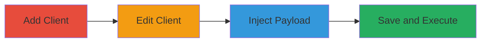

# Reflected XSS via Unsanitized Client Notes in MainWP WordPress Plugin

Multi-stage attack chain demonstrating exploitation of a reflected Cross-Site Scripting (XSS) vulnerability in the MainWP WordPress plugin's 'Notes' field within the Edit Client section. An authenticated admin user can inject malicious JavaScript, which is not sanitized and is immediately reflected in the HTML response upon saving, executing in the browser. This poses client-side risks such as session hijacking or data theft for the admin, highlights broader input validation flaws, and undermines trust in the dashboard, though it requires dashboard access and does not propagate to other users.

## Chain Metrics Dashboard

| Metric | Value |
|--------|-------|
| Chain Status | Unverified |
| Total Steps | 4 |
| Execution Time | ~2 minutes |
| Skill Level | Beginner |
| Complexity | Low |
| Impact Level | Medium |

## Attack Flow Visualization

## Prerequisites & Requirements

### Required Tools

- Web browser (e.g., Chrome with developer tools for payload testing)

### Target Environment

- WordPress site with MainWP plugin installed and configured
- Admin dashboard access
- PHP-based web server

### Initial Access Requirements

- Valid admin credentials for MainWP dashboard
- Direct network access to the WordPress admin interface
- No prior access needed beyond authentication

## Detailed Attack Procedures

### Step 1: Add New Client
procedure: [[procedures/Add-New-Client-in-MainWP-Dashboard]]

**Objective**: Create a new client entry to serve as the target for editing and payload injection.

**Instructions**: Log in to the MainWP dashboard, navigate to the client management section, and add a basic client profile with minimal details like name and website URL.

**Expected Output**: Confirmation of new client creation, with the client listed in the dashboard.

**Success Indicators**:
- New client appears in the client list
- No errors during creation

### Step 2: Navigate to Edit Client Page
procedure: [[procedures/Navigate-to-Edit-Client-Page]]

**Objective**: Access the editable interface for the newly created client to reach the vulnerable notes field.

**Instructions**: From the client management overview, select the new client and click the edit option to load the Edit Client form, ensuring the notes field is visible.

**Expected Output**: Edit Client page loads with form fields populated from the client data.

**Success Indicators**:
- Edit form displays correctly
- Notes input field is accessible

### Step 3: Inject Malicious JavaScript in Notes Field
procedure: [[procedures/Inject-Malicious-JavaScript-in-Notes-Field]]

**Objective**: Insert a JavaScript payload into the notes field to test for reflection without sanitization.

**Instructions**: In the notes textarea, enter a payload such as `` or an inline event handler like `onload=alert('XSS')`. Avoid saving yet to prepare for observation.

**Expected Output**: Payload entered in the field without immediate errors or stripping.

**Success Indicators**:
- Payload text remains intact in the input
- No client-side validation blocks the input

### Step 4: Save Form and Trigger XSS Reflection
procedure: [[procedures/Save-Form-and-Trigger-XSS-Reflection]]

**Objective**: Submit the form to cause the unsanitized input to reflect in the response and execute the JavaScript.

**Instructions**: Click the save button on the Edit Client form. Monitor the browser's developer console or page for immediate execution of the payload.

**Expected Output**: Form saves, page refreshes or redirects, and the JavaScript executes (e.g., alert box pops up) due to reflection in the HTML.

**Success Indicators**:
- JavaScript payload executes in the browser
- No server-side sanitization prevents reflection
- Payload not stored persistently but reflected on response

## Attack Chain Summary

### Key Achievements

1. Successful injection and immediate execution of arbitrary JavaScript in the admin browser
2. Demonstration of input sanitization failure in the MainWP plugin
3. Highlighting of client-side risks without affecting other users

## Technique & Tactic Coverage

### MITRE ATT&CK Techniques

- [[JavaScript]]

### MITRE ATT&CK Tactics

- [[Execution]]

---
*Last updated: 2023-10-01T12:00:00Z*
