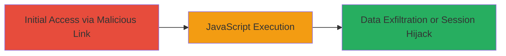

---
tags:
  - xss
  - reflected-xss
  - web-vulnerability
type: attack_chain
tools: []
tactics:
  - '[[Execution]]'
verified: false
platforms:
  - Web
submitted: true
complexity: low
created_at: '2023-10-01T00:00:00Z'
procedures:
  - '[[procedures/Exploit-Reflected-XSS-in-Error-Parameter]]'
step_count: 1
techniques:
  - '[[JavaScript]]'
updated_at: '2025-12-13T23:52:20.803Z'
description: >-
  A single-stage attack exploiting a reflected XSS vulnerability in the 'Error'
  GET parameter on my.acronis.com, allowing arbitrary JavaScript execution in
  the victim's browser.
skill_level: beginner
impact_level: low
id: 75ab36a6-b026-4b52-a616-4cf1ecfc50e7
validated: true
mitre_tactics:
  - '[[Execution]]'
mitre_techniques:
  - '[[JavaScript]]'
---
# Reflected XSS via Unsanitized Error Parameter on my.acronis.com

Multi-stage attack chain demonstrating a complete attack workflow.

## Chain Metrics Dashboard

| Metric | Value |
|--------|-------|
| Chain Status | Unverified |
| Total Steps | 1 |
| Execution Time | ~1 minutes |
| Skill Level | Beginner |
| Complexity | Low |
| Impact Level | Low |

## Attack Flow Visualization



## Prerequisites & Requirements

### Required Tools

- Web browser (e.g., Chrome, Firefox)
- Optional: Proxy tool like Burp Suite for payload testing

### Target Environment

- Web platform
- Access to my.acronis.com
- No specific ports or services required beyond standard HTTP/HTTPS

### Initial Access Requirements

- Victim must click a malicious link
- No prior credentials or network position needed; social engineering to lure victim

## Detailed Attack Procedures

### Step 1: Trigger Reflected XSS
procedure: [[procedures/Exploit-Reflected-XSS-in-Error-Parameter]]

**Objective**: Inject and execute arbitrary JavaScript code via the unsanitized 'Error' GET parameter to demonstrate vulnerability, potentially leading to session hijacking or phishing.

**Instructions**: Construct a malicious URL with a JavaScript payload in the 'Error' parameter and send it to the victim via email, link, or other means. When the victim accesses the URL, the payload reflects back unsanitized and executes in their browser.

Example payload URL:

```bash
curl "https://my.acronis.com/?Error=%3Cscript%3Ealert('XSS')%3C/script%3E" -v
```

Or directly in browser: https://my.acronis.com/?Error=<script>alert('XSS')</script>

**Expected Output**: An alert box pops up in the browser saying 'XSS', confirming JavaScript execution. In a real attack, replace alert with code to steal cookies or redirect to a phishing site.

**Success Indicators**:
- JavaScript alert or other payload effect observed
- No server-side sanitization blocking the script tag

## Attack Chain Summary

### Key Achievements

1. Successful injection of JavaScript via reflected 'Error' parameter
2. Demonstration of arbitrary code execution in victim browser
3. Potential for low-impact actions like session theft or phishing

## Technique & Tactic Coverage

### MITRE ATT&CK Techniques

- [[JavaScript]]

### MITRE ATT&CK Tactics

- [[Execution]]

---
*Last updated: 2023-10-01T00:00:00Z*
