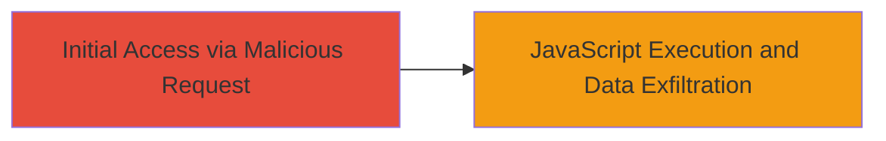

---
tags:
  - xss
  - reflected-xss
  - web
  - asp.net
  - javascript-execution
type: attack_chain
tools: []
tactics:
  - '[[Initial Access]]'
  - '[[Execution]]'
  - '[[Collection]]'
verified: false
platforms:
  - Web
submitted: true
complexity: low
created_at: '2023-10-01T00:00:00Z'
procedures:
  - '[[procedures/Exploit-Reflected-XSS-via-HTTP-Referer-Header]]'
step_count: 1
techniques:
  - '[[Exploit Public-Facing Application]]'
  - '[[JavaScript]]'
updated_at: '2025-12-14T03:46:38.151Z'
description: >-
  A single-stage attack exploiting a reflected XSS vulnerability in the
  /header.aspx endpoint by injecting a malicious payload into the HTTP Referer
  header, leading to JavaScript execution in the victim's browser.
skill_level: beginner
impact_level: high
id: 5373e128-77d4-44a4-81e1-b1abb8ed5ee7
validated: true
mitre_tactics:
  - '[[Initial Access]]'
  - '[[Execution]]'
  - '[[Collection]]'
mitre_techniques:
  - '[[Exploit Public-Facing Application]]'
  - '[[JavaScript]]'
---
# Reflected XSS via Unsanitized HTTP Referer Header on ASP.NET Endpoint

Multi-stage attack chain demonstrating a complete attack workflow.

## Chain Metrics Dashboard

| Metric | Value |
|--------|-------|
| Chain Status | Unverified |
| Total Steps | 1 |
| Execution Time | ~1 minute |
| Skill Level | Beginner |
| Complexity | Low |
| Impact Level | High |

## Attack Flow Visualization



## Prerequisites & Requirements

### Required Tools

- [[tools/curl]]

### Target Environment

- Web platform with ASP.NET and Microsoft IIS
- Accessible public-facing endpoint (/header.aspx)
- No authentication required for the vulnerable page

### Initial Access Requirements

- Network access to the target domain (gamesclub.mtn.com.gh)
- Ability to craft and send HTTP requests with custom headers
- Victim browser to render the reflected payload

## Detailed Attack Procedures

### Step 1: Inject Malicious Payload into Referer Header
procedure: [[procedures/Exploit-Reflected-XSS-via-HTTP-Referer-Header]]

**Objective**: Send a crafted GET request to the vulnerable endpoint with a JavaScript payload in the Referer header to trigger XSS execution upon page rendering.

**Instructions**: Use [[commands/curl-send-reflected-xss-referer]] to send the request:

```bash
curl -X GET "https://gamesclub.mtn.com.gh/header.aspx" -H "Referer: https://www.google.com/search?hl=en&q=testing\'()&%>" -v
```

To test in a browser, set the Referer header using developer tools or a proxy like Burp Suite, then visit the endpoint and observe the alert popup confirming execution.

**Expected Output**: The response HTML reflects the payload unsanitized, e.g., containing ``, which executes JavaScript showing the domain in an alert.

**Success Indicators**:
- JavaScript alert fires in the browser
- Payload visible in the rendered HTML source
- Potential access to cookies or localStorage via enhanced payload

## Attack Chain Summary

### Key Achievements

1. Successful injection and reflection of XSS payload via HTTP Referer header
2. Arbitrary JavaScript execution in the victim's browser context
3. Potential theft of session tokens, enabling user impersonation and further attacks

## Technique & Tactic Coverage

### MITRE ATT&CK Techniques

- [[Exploit Public-Facing Application]]
- [[JavaScript]]

### MITRE ATT&CK Tactics

- [[Initial Access]]
- [[Execution]]
- [[Collection]]

---
*Last updated: 2023-10-01T00:00:00Z*
