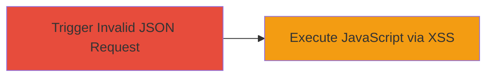

# Reflected XSS via Unsanitized Invalid JSON in Server Error Response

Multi-stage attack chain demonstrating a complete attack workflow.

## Chain Metrics Dashboard

| Metric | Value |
|--------|-------|
| Chain Status | Unverified |
| Total Steps | 1 |
| Execution Time | ~1 minutes |
| Skill Level | Beginner |
| Complexity | Low |
| Impact Level | Medium |

## Attack Flow Visualization



## Prerequisites & Requirements

### Required Tools

- None (uses standard HTTP client like curl)

### Target Environment

- Web application with JSON API endpoints
- Server that returns HTML-rendered error pages for invalid JSON
- No specific ports required beyond standard HTTP/HTTPS (80/443)

### Initial Access Requirements

- Network access to the target web application
- No credentials needed for public-facing endpoints
- Victim must interact with the crafted error page (e.g., via phishing or direct access)

## Detailed Attack Procedures

### Step 1: Trigger Reflected XSS
procedure: [[procedures/Trigger-Reflected-XSS-with-Invalid-JSON-Input]]

**Objective**: Send a malformed JSON request to elicit an error response that reflects unsanitized input, executing JavaScript in the browser when the HTML error page is rendered.

**Instructions**: Craft an invalid JSON payload embedding a JavaScript payload, such as an alert, and send it via POST to a JSON-accepting endpoint. Use [[commands/curl-send-invalid-json-xss]] to simulate the request:

```bash
curl -X POST -H "Content-Type: application/json" -d '{"invalid": "<script>alert(\"XSS\")</script>"}' https://target.com/api/endpoint
```

Observe the server error response, which includes the reflected payload in the HTML body without escaping.

**Expected Output**: Server returns an HTML error page like "Invalid JSON: {"invalid": "<script>alert(\"XSS\")</script>"}", triggering the alert when viewed in a browser.

**Success Indicators**:
- JavaScript alert or payload executes in the browser
- Reflected input appears unescaped in the error HTML

## Attack Chain Summary

### Key Achievements

1. Successful reflection of malicious JavaScript in server error response
2. Arbitrary code execution in victim's browser context
3. Potential for session hijacking or data theft via further payload escalation

## Technique & Tactic Coverage

### MITRE ATT&CK Techniques

- [[JavaScript]]

### MITRE ATT&CK Tactics

- [[Execution]]

---
*Last updated: 2023-10-01T00:00:00Z*
