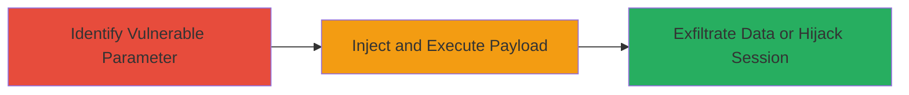

# Reflected XSS via Unsanitized Language Parameter in TikTok Domains

Multi-stage attack chain demonstrating a complete attack workflow.

## Chain Metrics Dashboard

| Metric | Value |
|--------|-------|
| Chain Status | Unverified |
| Total Steps | 1 |
| Execution Time | ~5 minutes |
| Skill Level | Intermediate |
| Complexity | Low |
| Impact Level | High |

## Attack Flow Visualization



## Prerequisites & Requirements

### Required Tools

- Web browser (e.g., Chrome Developer Tools for testing)
- Optional: Proxy tool like Burp Suite for request manipulation

### Target Environment

- Web platform
- Access to TikTok domains (publicly accessible)
- No specific ports or services required beyond standard HTTPS (443)

### Initial Access Requirements

- No credentials needed
- Public network access to TikTok domains
- Ability to craft and deliver malicious URLs to victims (e.g., via phishing)

## Detailed Attack Procedures

### Step 1: Identify and Exploit Language Parameter
procedure: [[procedures/Exploit-Reflected-XSS-in-Language-Parameter]]

**Objective**: Test and confirm the reflected XSS vulnerability in the language parameter across multiple TikTok domains, then inject a payload to execute arbitrary JavaScript in the victim's browser.

**Instructions**: Begin by constructing a test URL targeting a TikTok domain with a benign payload to check for reflection. Use a browser to visit the URL and inspect if the input is echoed back unsanitized. If confirmed, escalate to a malicious payload for execution.

For testing reflection, craft a URL like:

```bash
# Example test URL (visit in browser)
https://www.tiktok.com/?lang=test123
```

Inspect the response or page source to see if "test123" is reflected without encoding. If vulnerable, inject a JavaScript payload using [[commands/inject-xss-payload]]:

```bash
# Malicious URL example (deliver to victim via link)
https://www.tiktok.com/?lang=%3Cscript%3Ealert%28%27XSS%27%29%3C%2Fscript%3E
```

Replace the domain with affected ones (e.g., m.tiktok.com, www.tiktok.com). Observe if the alert pops up in the browser, confirming execution.

**Expected Output**: The injected script executes, displaying an alert or performing actions like stealing cookies via document.cookie.

**Success Indicators**:
- Input reflected in page without HTML/JS encoding
- JavaScript payload executes (e.g., alert box appears)
- Potential for further actions like sending session data to attacker-controlled server

## Attack Chain Summary

### Key Achievements

1. Identified unsanitized language parameter in multiple TikTok domains
2. Demonstrated arbitrary JavaScript execution via reflected XSS
3. Enabled potential client-side attacks such as session hijacking or data exfiltration

## Technique & Tactic Coverage

### MITRE ATT&CK Techniques

- [[JavaScript]]
- [[Exploit Public-Facing Application]]

### MITRE ATT&CK Tactics

- [[Execution]]
- [[Collection]]

---
*Last updated: 2023-10-01T00:00:00Z*
