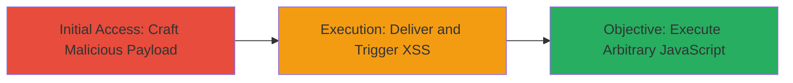

# Reflected XSS via Unsanitized Link Parameter in TikTok Endpoint

Multi-stage attack chain demonstrating exploitation of a reflected Cross-Site Scripting (XSS) vulnerability in the TikTok.com endpoint through the 'link' parameter, allowing arbitrary JavaScript execution in a victim's browser.

## Chain Metrics Dashboard

| Metric | Value |
|--------|-------|
| Chain Status | Unverified |
| Total Steps | 2 |
| Execution Time | ~1 minutes |
| Skill Level | Beginner |
| Complexity | Low |
| Impact Level | High |

## Attack Flow Visualization



## Prerequisites & Requirements

### Required Tools

- Browser developer tools for payload testing

### Target Environment

- Web platform
- Access to TikTok.com endpoint
- No specific ports or services required beyond standard HTTPS (443)

### Initial Access Requirements

- No credentials needed
- Victim must click a crafted malicious link
- Attacker requires ability to send links (e.g., via email, social engineering)

## Detailed Attack Procedures

### Step 1: Craft Malicious Payload
procedure: [[procedures/Exploit-Reflected-XSS-in-Link-Parameter]]

**Objective**: Identify and encode a JavaScript payload that reflects unsanitized in the 'link' parameter without being escaped.

**Instructions**: Use a simple alert payload to test reflection. Encode it to bypass basic filters if present. For example, test with URL encoding for special characters.

Execute [[commands/curl-test-xss-payload]] to send a test request:

```bash
curl -X GET "https://www.tiktok.com/some-endpoint?link=%3Cscript%3Ealert%28%27XSS%27%29%3C%2Fscript%3E" -v
```

If the payload reflects in the response, proceed to delivery.

**Expected Output**: HTTP response containing the unescaped script tag, visible in browser when loaded.

**Success Indicators**:
- Payload appears in page source without escaping
- Alert box pops up in browser on load

### Step 2: Deliver and Trigger XSS
procedure: [[procedures/Exploit-Reflected-XSS-in-Link-Parameter]]

**Objective**: Socially engineer the victim to click the malicious link, leading to JavaScript execution in their browser context.

**Instructions**: Construct the full malicious URL and distribute it (e.g., via phishing email or shortened link). Monitor for execution via callback if payload includes data exfiltration.

Use [[commands/curl-test-xss-payload]] to verify the full link before sending:

```bash
curl -X GET "https://www.tiktok.com/some-endpoint?link=%3Cscript%3Ealert%28document.domain%29%3C%2Fscript%3E" -v
```

Replace with victim-specific delivery method.

**Expected Output**: Victim's browser executes the script, e.g., displaying an alert with the domain.

**Success Indicators**:
- Victim reports or attacker observes execution (e.g., via beacon to attacker's server)
- Potential for further actions like cookie theft if payload expanded

## Attack Chain Summary

### Key Achievements

1. Successful injection of arbitrary JavaScript via reflected 'link' parameter
2. Execution in victim's browser, enabling session hijacking or data theft
3. Vulnerability reported and resolved by TikTok post-disclosure

## Technique & Tactic Coverage

### MITRE ATT&CK Techniques

- [[JavaScript]]

### MITRE ATT&CK Tactics

- [[Execution]]

---
*Last updated: 2023-10-01T00:00:00Z*
