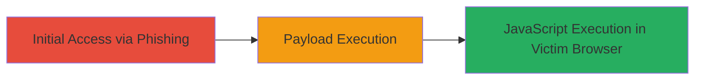

# Reflected XSS via Unsanitized Parameters on TikTok Website

Multi-stage attack chain demonstrating a complete attack workflow exploiting a reflected XSS vulnerability on TikTok.com.

## Chain Metrics Dashboard

| Metric | Value |
|--------|-------|
| Chain Status | Unverified |
| Total Steps | 1 |
| Execution Time | ~1 minutes |
| Skill Level | Intermediate |
| Complexity | Low |
| Impact Level | High |

## Attack Flow Visualization

## Prerequisites & Requirements

### Required Tools

- [[tools/Burp-Suite]]

### Target Environment

- Web platform (TikTok.com)
- No specific services/ports required beyond standard HTTP/HTTPS (ports 80/443)
- Public internet access to TikTok.com

### Initial Access Requirements

- Ability to craft and deliver malicious links (e.g., via email or social engineering)
- Victim interaction required (clicking the link)
- No prior credentials or network position needed

## Detailed Attack Procedures

### Step 1: Deliver and Execute XSS Payload
procedure: [[procedures/Exploit-Reflected-XSS-in-TikTok-Parameters]]

**Objective**: Craft a malicious URL with a reflected XSS payload targeting unsanitized parameters on TikTok.com, deliver it to the victim, and achieve arbitrary JavaScript execution in their browser upon interaction.

**Instructions**: Identify vulnerable parameters (e.g., search or URL parameters) through testing with Burp Suite. Craft a payload such as `` and append it to a TikTok URL, e.g., `https://www.tiktok.com/search?q=`. Use Burp Suite's Repeater to test reflection and evasion. Deliver the URL via phishing email or direct message. When the victim visits the link while logged in, the payload executes, potentially stealing session cookies or performing other actions.

**Expected Output**: Alert box displaying cookies or successful script execution (e.g., data exfiltration to attacker-controlled server).

**Success Indicators**:
- Payload reflects without sanitization in the page source
- JavaScript executes in victim's browser (e.g., alert fires)
- Session data captured or actions performed (e.g., keylogging initiated)

## Attack Chain Summary

### Key Achievements

1. Successful identification of reflected XSS in multiple parameters on TikTok.com
2. Arbitrary JavaScript execution leading to potential session hijacking or data theft
3. Vulnerability reported, resolved by TikTok with bounty awarded

## Technique & Tactic Coverage

### MITRE ATT&CK Techniques

- [[JavaScript]]
- [[Drive-by Compromise]]

### MITRE ATT&CK Tactics

- [[Execution]]
- [[Initial Access]]

---
*Last updated: 2023-10-01T00:00:00Z*
