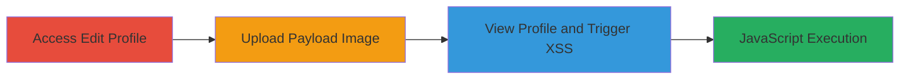

# Reflected XSS via Unsanitized Profile Image Filename in FanFootage

Multi-stage attack chain demonstrating a complete reflected XSS workflow in the FanFootage Ruby on Rails application using Paperclip for file uploads. The attack leverages an unsanitized filename reflection in the profile page HTML to inject and execute JavaScript, potentially stealing session cookies or performing other client-side attacks. Discovered via HackerOne report #93807, the payload executes in browsers like Firefox but may be blocked by Chrome's XSS filter.

## Chain Metrics Dashboard

| Metric | Value |
|--------|-------|
| Chain Status | Unverified |
| Total Steps | 3 |
| Execution Time | ~5 minutes |
| Skill Level | Intermediate |
| Complexity | Medium |
| Impact Level | High |

## Attack Flow Visualization

## Prerequisites & Requirements

### Required Tools

- Web browser (e.g., Firefox for reliable execution)

### Target Environment

- Web application: FanFootage (Ruby on Rails with Paperclip gem)
- Required services/ports: HTTP/HTTPS on standard web ports (80/443)
- Network access requirements: Direct access to the application's profile edit and view pages

### Initial Access Requirements

- Valid user account on FanFootage
- Ability to authenticate and access profile features
- No prior elevated access needed

## Detailed Attack Procedures

### Step 1: Access Edit Profile
procedure: [[procedures/Access-Edit-Profile-and-Upload-Image]]

**Objective**: Navigate to the profile edit page and prepare for image upload to exploit the filename reflection vulnerability.

**Instructions**: Log in to the FanFootage application with a valid account, then navigate to the edit profile section. Locate the profile image upload feature, which uses Paperclip for handling uploads without filename sanitization.

**Expected Output**: The edit profile page loads, displaying the file upload input for the profile image.

**Success Indicators**:
- Profile edit page accessible
- Upload form visible

### Step 2: Prepare and Upload Malicious Image
procedure: [[procedures/Rename-Image-with-XSS-Payload]]

**Objective**: Craft an image file with an XSS payload in the filename to inject HTML/JavaScript that will be reflected unsanitized in the profile view.

**Instructions**: Select a benign image file (e.g., a .jpg), rename it to include the payload such as `'><svg onload=alert(1)>.jpg`. This payload closes any preceding HTML tag and injects an SVG element that executes JavaScript on load. Proceed to upload the file via the profile image upload form.

**Expected Output**: Upload completes successfully without errors, and the application stores the filename for later reflection.

**Success Indicators**:
- File upload accepted
- No server-side validation errors on filename

### Step 3: Trigger XSS Execution
procedure: [[procedures/Trigger-XSS-on-Profile-View]]

**Objective**: View the updated profile page to trigger the reflected XSS payload, executing arbitrary JavaScript in the viewer's browser context.

**Instructions**: After upload, navigate to or refresh the profile view page. The unsanitized filename is inserted directly into the HTML (e.g., in an img src or text node), causing the browser to parse and execute the injected SVG onload event.

**Expected Output**: JavaScript alert (or custom payload) executes, confirming XSS. In a real attack, this could steal cookies via `document.cookie` or redirect to a phishing site.

**Success Indicators**:
- Alert box or console error indicating execution
- Payload triggers in Firefox; check Chrome dev tools for blocking

## Attack Chain Summary

### Key Achievements

1. Successful injection of XSS payload via filename without detection
2. Arbitrary JavaScript execution in victim browser context
3. Potential for session hijacking or data theft from profile viewers

## Technique & Tactic Coverage

### MITRE ATT&CK Techniques

- [[JavaScript]]

### MITRE ATT&CK Tactics

- [[Execution]]
- [[Collection]]

---
*Last updated: 2023-10-01T00:00:00Z*
