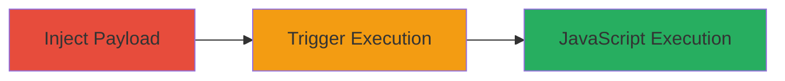

# Reflected XSS via Unsanitized Project Names in Localize Platform

Multi-stage attack chain demonstrating a complete attack workflow exploiting insufficient input sanitization in the Localize platform's project naming feature.

## Chain Metrics Dashboard

| Metric | Value |
|--------|-------|
| Chain Status | Unverified |
| Total Steps | 2 |
| Execution Time | ~5 minutes |
| Skill Level | Intermediate |
| Complexity | Medium |
| Impact Level | High |

## Attack Flow Visualization

## Prerequisites & Requirements

### Required Tools

- Web browser (e.g., Chrome with developer tools)
- Access to a Localize account with project creation privileges

### Target Environment

- Localize web platform
- No specific ports or services required beyond standard HTTPS access

### Initial Access Requirements

- Valid user account on Localize platform
- Ability to create projects (authenticated session)
- Target translators must visit the main page post-injection

## Detailed Attack Procedures

### Step 1: Inject Malicious Payload into Project Name
procedure: [[procedures/Exploiting-Reflected-XSS-in-Localize-Project-Names]]

**Objective**: Create a project with an unsanitized XSS payload in the name to store the malicious input for later reflection.

**Instructions**: Log in to the Localize platform and navigate to the project creation interface. In the project name field, enter a payload that breaks out of the HTML context and injects executable JavaScript, such as "><svg onload="prompt(/xss/);"><!--. Save the project to persist the tainted name.

**Expected Output**: Project created successfully with the malicious name stored in the system.

**Success Indicators**:
- Project appears in your project list with the exact payload in the name
- No immediate errors during project creation

### Step 2: Trigger XSS Execution on Main Page
procedure: [[procedures/Exploiting-Reflected-XSS-in-Localize-Project-Names]]

**Objective**: Cause the payload to execute in a victim's browser by having them view the recent visits section, which renders the unsanitized project name.

**Instructions**: Ensure the tainted project appears in the recent visits list (e.g., by accessing it yourself). Instruct or wait for a translator to visit the main page. The platform will display the recent visits, including the project name, triggering the SVG onload event to execute the JavaScript prompt.

**Expected Output**: An alert box with "xss" appears in the translator's browser, confirming arbitrary JavaScript execution.

**Success Indicators**:
- Alert prompt fires in the victim's browser
- Browser console shows JavaScript execution from the onload event
- Potential for further payloads to steal session cookies via document.cookie

## Attack Chain Summary

### Key Achievements

1. Successful injection of XSS payload into a persistent project name without sanitization
2. Reflection and execution of JavaScript in unauthorized user contexts (translators)
3. Demonstration of client-side impact, including potential session hijacking or data exfiltration

## Technique & Tactic Coverage

### MITRE ATT&CK Techniques

- [[JavaScript]]

### MITRE ATT&CK Tactics

- [[Execution]]

---
*Last updated: 2023-10-01T00:00:00Z*
