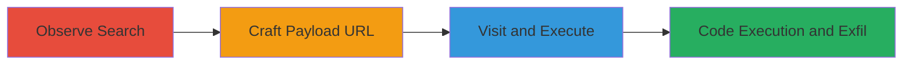

---
tags:
  - xss
  - reflected-xss
  - javascript-injection
  - url-injection
type: attack_chain
tools: []
tactics:
  - '[[Execution]]'
verified: false
platforms:
  - Web
submitted: true
complexity: low
created_at: '2023-10-01T00:00:00Z'
procedures:
  - '[[procedures/Observe-Normal-Search-Behavior]]'
  - '[[procedures/Craft-Malicious-Search-URL]]'
  - '[[procedures/Trigger-XSS-via-URL-Visit]]'
step_count: 3
techniques:
  - '[[JavaScript]]'
updated_at: '2025-12-14T03:15:27.011Z'
description: >-
  A multi-step attack exploiting a reflected XSS vulnerability in the
  Informatica community marketplace search function by injecting JavaScript
  payloads into the URL path, leading to arbitrary code execution in the
  victim's browser.
skill_level: beginner
impact_level: high
id: 636bba84-1e23-4283-9742-35016045a6f4
validated: true
mitre_tactics:
  - '[[Execution]]'
mitre_techniques:
  - '[[JavaScript]]'
---
# Reflected XSS via Unsanitized Search Query in Informatica Community Marketplace

Multi-stage attack chain demonstrating a complete reflected XSS exploit in the Informatica community marketplace search functionality.

## Chain Metrics Dashboard

| Metric | Value |
|--------|-------|
| Chain Status | Unverified |
| Total Steps | 3 |
| Execution Time | ~1 minutes |
| Skill Level | Beginner |
| Complexity | Low |
| Impact Level | High |

## Attack Flow Visualization

## Prerequisites & Requirements

### Required Tools

- Web browser (e.g., Chrome, Firefox)

### Target Environment

- Web platform
- Access to https://community.informatica.com/community/marketplace/
- No special services or ports required

### Initial Access Requirements

- Public internet access
- No credentials needed for anonymous search page
- Victim must visit the crafted URL (e.g., via phishing)

## Detailed Attack Procedures

### Step 1: Observe Normal Search Behavior
procedure: [[procedures/Observe-Normal-Search-Behavior]]

**Objective**: Understand how the search functionality constructs URLs to identify injection points.

**Instructions**: Navigate to the Informatica community marketplace page and perform a standard search to observe the resulting URL structure.

**Expected Output**: A URL like https://community.informatica.com/community/marketplace/search/?blkCatIds=free+apps&view=solution, where the search term appears in the path or query parameters.

**Success Indicators**:
- URL path after /search/ reflects the input search term without sanitization
- Page loads with search results

### Step 2: Craft Malicious Search URL
procedure: [[procedures/Craft-Malicious-Search-URL]]

**Objective**: Inject a JavaScript payload into the search query to create a reflected XSS vector.

**Instructions**: Replace the search term in the URL with a payload like ';alert(0);t=', then URL-encode it to %22;alert(0);t=%22, resulting in a modified URL such as https://community.informatica.com/community/marketplace/%22;alert(0);t=%22/?blkCatIds=free+apps&view=solution.

**Expected Output**: A crafted URL ready for testing, with the encoded payload in the path.

**Success Indicators**:
- Payload is properly URL-encoded
- URL structure mimics legitimate search but includes injection

### Step 3: Trigger XSS via URL Visit
procedure: [[procedures/Trigger-XSS-via-URL-Visit]]

**Objective**: Execute the injected JavaScript by visiting the malicious URL, demonstrating arbitrary code execution.

**Instructions**: Open the crafted URL in a web browser. The payload will inject into the page's inline JavaScript, altering code like var projectChooserUrl ="/community/marketplace/"; to execute alert(0) and potentially further payloads.

**Expected Output**: An alert box pops up displaying '0', confirming XSS execution. Further payloads could exfiltrate cookies to an attacker-controlled server.

**Success Indicators**:
- JavaScript alert executes
- Browser console shows no errors, but payload runs
- Potential for cookie theft or account takeover if escalated

## Attack Chain Summary

### Key Achievements

1. Identified unsanitized URL path injection in search functionality
2. Successfully injected and executed JavaScript payload
3. Demonstrated potential for session hijacking via cookie exfiltration

## Technique & Tactic Coverage

### MITRE ATT&CK Techniques

- [[JavaScript]]

### MITRE ATT&CK Tactics

- [[Execution]]

---
*Last updated: 2023-10-01T00:00:00Z*
