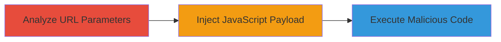

---
id: ac-239762
name: Reflected XSS via Unsanitized URL Parameter in Checkout Flow
type: attack_chain
description: A multi-step attack exploiting a reflected XSS vulnerability in the checkout flow of a web application by manipulating an unsanitized URL parameter to execute arbitrary JavaScript.
verified: false
submitted: false
step_count: 2
created_at: 2024-01-01T00:00:00Z
updated_at: 2024-01-01T00:00:00Z
procedures: [[procedures/Analyze-Checkout-Flow-for-Vulnerable-URL-Parameters]], [[procedures/Inject-JavaScript-Payload-via-URL-Parameter]]
techniques: [[JavaScript]]
tactics: [[Execution]]
tags: xss, reflected-xss, javascript-injection, web-vulnerability
platforms: Web
tools: []
complexity: medium
skill_level: intermediate
impact_level: high
---

# Reflected XSS via Unsanitized URL Parameter in Checkout Flow

Multi-stage attack chain demonstrating a complete attack workflow exploiting XSS in a web application's checkout process.

## Chain Metrics Dashboard

| Metric | Value |
|--------|-------|
| Chain Status | Unverified |
| Total Steps | 2 |
| Execution Time | ~5 minutes |
| Skill Level | Intermediate |
| Complexity | Medium |
| Impact Level | High |

## Attack Flow Visualization

## Prerequisites & Requirements

### Required Tools

- Web browser with developer tools (e.g., Chrome DevTools)

### Target Environment

- Web application platform
- Access to checkout flow at https://app.goodhire.com/member/GH.aspx
- No specific ports or services required beyond standard HTTPS (443)

### Initial Access Requirements

- Public access to the web application
- No credentials needed for initial testing
- Network access to the target URL

## Detailed Attack Procedures

### Step 1: Analyze Checkout Flow for Vulnerable URL Parameters
procedure: [[procedures/Analyze-Checkout-Flow-for-Vulnerable-URL-Parameters]]

**Objective**: Identify the URL parameter in the checkout flow that is unsanitized and directly inserted into JavaScript code for rendering cart contents.

**Instructions**: Navigate to the checkout page and use browser developer tools to inspect how URL parameters are handled. Look for parameters passed to the page that influence JavaScript variables without escaping.

**Expected Output**: Confirmation that a specific URL parameter (e.g., ?cart=) is used directly in a JavaScript context like var cartItems = decodeURIComponent(getParam('cart')); without sanitization.

**Success Indicators**:
- Parameter identified in page source or network requests
- Evidence of direct insertion into JavaScript without encoding

### Step 2: Inject JavaScript Payload via URL Parameter
procedure: [[procedures/Inject-JavaScript-Payload-via-URL-Parameter]]

**Objective**: Craft and deliver a malicious payload through the vulnerable URL parameter to execute arbitrary JavaScript on the victim's browser.

**Instructions**: Modify the URL by appending a payload to the vulnerable parameter, such as ?cart=, and load the page. Observe the execution in the browser.

**Expected Output**: Alert box or other JavaScript execution confirming the vulnerability, such as a pop-up or console log.

**Success Indicators**:
- JavaScript code executes on page load
- Potential for session hijacking or data theft demonstrated

## Attack Chain Summary

### Key Achievements

1. Identified unsanitized URL parameter handling in checkout flow
2. Successfully injected and executed arbitrary JavaScript
3. Demonstrated high-impact client-side attack potential including session theft

## Technique & Tactic Coverage

### MITRE ATT&CK Techniques

- [[JavaScript]]

### MITRE ATT&CK Tactics

- [[Execution]]

---
*Last updated: 2024-01-01T00:00:00Z*
