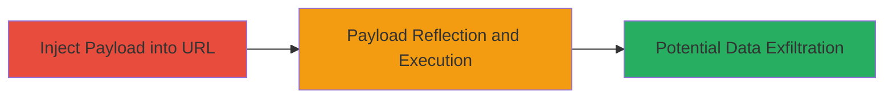

---
tags:
  - xss
  - reflected-xss
  - nginx
  - javascript
  - web-vulnerability
type: attack_chain
tools:
  - '[[tools/OWASP-XSS-Reference]]'
tactics:
  - '[[Execution]]'
  - '[[Collection]]'
commands: []
platforms:
  - Web
complexity: low
procedures:
  - '[[procedures/Exploit-Reflected-XSS-in-Status-Endpoint]]'
step_count: 2
techniques:
  - '[[JavaScript]]'
description: >-
  Demonstrates a reflected Cross-Site Scripting (XSS) attack by appending a
  malicious JavaScript payload to the URL path of the /status endpoint on an
  Nginx-served web server, resulting in unsanitized reflection and arbitrary
  code execution in the victim's browser.
skill_level: beginner
impact_level: high
id: 277fcaff-e6f7-4f0a-83ef-753e185810f8
created_at: '2025-12-14T03:16:37.492Z'
updated_at: '2025-12-14T03:16:37.492Z'
verified: false
validated: true
submitted: true
mitre_tactics:
  - '[[Execution]]'
  - '[[Collection]]'
mitre_techniques:
  - '[[JavaScript]]'
---
# Reflected XSS via Unsanitized URL Path in Nginx /status Endpoint

Multi-stage attack chain demonstrating a complete reflected XSS workflow on a vulnerable Nginx web server endpoint.

## Chain Metrics Dashboard

| Metric | Value |
|--------|-------|
| Chain Status | Unverified |
| Total Steps | 2 |
| Execution Time | ~1 minute |
| Skill Level | Beginner |
| Complexity | Low |
| Impact Level | High |

## Attack Flow Visualization



## Prerequisites & Requirements

### Required Tools

- [[tools/OWASP-XSS-Reference]] (for understanding XSS payloads and prevention)
- Web browser (e.g., Chrome, Firefox)

### Target Environment

- Web platform with Nginx web server
- Exposed service on port 8080
- Publicly accessible /status endpoint without input sanitization

### Initial Access Requirements

- Network access to the target server (e.g., http://h1b4e.n2.ips.mtn.co.ug:8080)
- No credentials required (public-facing endpoint)
- Victim's browser to render the reflected content

## Detailed Attack Procedures

### Step 1: Inject Malicious Payload into Vulnerable Endpoint
procedure: [[procedures/Exploit-Reflected-XSS-in-Status-Endpoint]]

**Objective**: Append a URL-encoded JavaScript payload to the /status path to test for reflection without sanitization.

**Instructions**: Construct the malicious URL by encoding the payload `'><script>alert(31337)</script>` and appending it to the endpoint. Open a web browser and navigate to the following URL:

```url
http://h1b4e.n2.ips.mtn.co.ug:8080/status%3E%3Cscript%3Ealert(31337)%3C%2Fscript%3E
```

This injects the payload directly into the path, which the server reflects into the HTML response.

**Expected Output**: The page loads with the injected script embedded in the HTML source, visible upon inspection (e.g., via browser developer tools).

**Success Indicators**:
- Payload appears in the page source without encoding
- No server error; page renders normally

### Step 2: Observe Payload Execution
procedure: [[procedures/Exploit-Reflected-XSS-in-Status-Endpoint]]

**Objective**: Confirm arbitrary JavaScript execution by observing the reflected payload's behavior in the browser.

**Instructions**: After navigating to the injected URL, monitor the browser for automatic script execution. The reflected script should trigger immediately upon page load.

**Expected Output**: A browser alert dialog pops up displaying "31337", confirming JavaScript execution.

**Success Indicators**:
- Alert box appears with the specified message
- Browser console shows no errors related to script blocking
- Potential for further payloads to manipulate DOM or steal data (e.g., cookies)

## Attack Chain Summary

### Key Achievements

1. Successful injection of unsanitized user input into the HTML response via URL path manipulation
2. Arbitrary JavaScript execution in the context of the victim's browser session
3. Demonstration of high-impact risks including session hijacking, data theft, or page defacement

## Technique & Tactic Coverage

### MITRE ATT&CK Techniques

- [[JavaScript]]

### MITRE ATT&CK Tactics

- [[Execution]]
- [[Collection]]

---
*Last updated: 2023-10-01T00:00:00Z*
