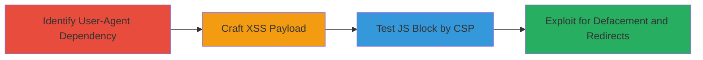

---
tags:
  - xss
  - reflected-xss
  - html-injection
  - defacement
  - open-redirect
  - csp-bypass
type: attack_chain
tools: []
tactics:
  - '[[Initial Access]]'
verified: false
platforms:
  - Web
submitted: true
complexity: medium
created_at: '2023-10-01T00:00:00Z'
procedures:
  - '[[procedures/Identify-Mobile-User-Agent-Dependency-on-Snapchat-Add-Page]]'
  - '[[procedures/Craft-Reflected-XSS-Payload-in-Username-Parameter]]'
  - '[[procedures/Test-JavaScript-Execution-Blocked-by-CSP]]'
  - '[[procedures/Exploit-HTML-Injection-for-Defacement-and-Redirects]]'
step_count: 4
techniques:
  - '[[Exploit Public-Facing Application]]'
  - '[[Drive-by Compromise]]'
updated_at: '2025-12-13T23:52:33.837Z'
description: >-
  A multi-step attack exploiting a reflected XSS vulnerability on Snapchat's add
  page by injecting malicious payloads into the username parameter, leading to
  HTML injection for page defacement and open redirects, despite CSP blocking
  JavaScript.
skill_level: intermediate
impact_level: medium
id: 3fc9e5e4-03a7-446c-ae66-c13726f2b96d
validated: true
mitre_tactics:
  - '[[Initial Access]]'
mitre_techniques:
  - '[[Exploit Public-Facing Application]]'
  - '[[Drive-by Compromise]]'
---
# Reflected XSS via Unsanitized Username Parameter on Snapchat Add Page

Multi-stage attack chain demonstrating exploitation of a reflected XSS vulnerability on Snapchat's add page at https://www.snapchat.com/add/snapchat, where the username parameter allows HTML injection into page elements, enabling defacement and redirects despite CSP restrictions on JavaScript.

## Chain Metrics Dashboard

| Metric | Value |
|--------|-------|
| Chain Status | Unverified |
| Total Steps | 4 |
| Execution Time | ~5 minutes |
| Skill Level | Intermediate |
| Complexity | Medium |
| Impact Level | Medium |

## Attack Flow Visualization

## Prerequisites & Requirements

### Required Tools

- Web browser with developer tools (e.g., Firefox, Chrome)
- User-Agent switching capability (browser extension or curl)

### Target Environment

- Web platform
- Access to https://www.snapchat.com/add/snapchat
- No authentication required

### Initial Access Requirements

- Public internet access
- Ability to craft and access custom URLs
- No prior credentials needed

## Detailed Attack Procedures

### Step 1: Identify Mobile User-Agent Dependency
procedure: [[procedures/Identify-Mobile-User-Agent-Dependency-on-Snapchat-Add-Page]]

**Objective**: Determine that the server serves different content based on User-Agent, revealing the vulnerable mobile page.

**Instructions**: Access the target URL https://www.snapchat.com/add/snapchat using a standard desktop User-Agent, then switch to a mobile User-Agent (e.g., iPhone) to observe the content change.

**Expected Output**: Mobile-optimized page loads, confirming user-agent-based rendering.

**Success Indicators**:
- Different HTML structure for mobile vs. desktop
- Vulnerable username reflection visible in mobile view

### Step 2: Craft Reflected XSS Payload
procedure: [[procedures/Craft-Reflected-XSS-Payload-in-Username-Parameter]]

**Objective**: Inject a basic HTML payload into the username parameter to confirm reflection in multiple page elements.

**Instructions**: Modify the URL to https://www.snapchat.com/add/%22%3E%3Ch1%3EXSS%3C%2Fh1%3E and access with mobile User-Agent. Observe reflection in meta tags, object tag, and h2 tag.

**Expected Output**: "XSS" text appears in page title, image tags, snapcode, and username header.

**Success Indicators**:
- Payload reflected in 6 locations: twitter:title, twitter:image, og:title, og:image, snapcode object, h2 username
- No sanitization of HTML entities

### Step 3: Test JavaScript Execution Blocked by CSP
procedure: [[procedures/Test-JavaScript-Execution-Blocked-by-CSP]]

**Objective**: Verify that injected JavaScript is blocked, limiting exploitation to non-script HTML.

**Instructions**: Append a script tag to the payload, e.g., https://www.snapchat.com/add/%22%3E%3Cscript%3Ealert(1)%3C/script%3E, and load with mobile User-Agent. Check browser console for CSP violations.

**Expected Output**: Script does not execute; console shows CSP block for inline scripts.

**Success Indicators**:
- Alert does not pop up
- CSP header restricts to Snapchat domains only

### Step 4: Exploit HTML Injection for Defacement and Redirects
procedure: [[procedures/Exploit-HTML-Injection-for-Defacement-and-Redirects]]

**Objective**: Use HTML injection to deface the page or perform open redirects via meta refresh.

**Instructions**: Test defacement with https://www.snapchat.com/add/%22%3E%3Ch1%20style=%22width:100%25;height:100%25;position:absolute;top:0;background-color:black;text-align:center;margin:0;color:white;font-size:256px%22%3EHACKED%3C/h1%3E%3Cstyle%3E. For redirect: https://www.snapchat.com/add/%22%3E%3Cmeta%20http-equiv=%22refresh%22%20content=%220;url=https://hackerone.com/%22%3E%3Cstyle%3E. Note browser-specific behavior (works in Firefox, blocked in Chrome).

**Expected Output**: Page background turns black with "HACKED" overlay; redirect to external site in compatible browsers (img-src allows Google Cloud Storage).

**Success Indicators**:
- Visual defacement on load
- Automatic redirect in non-auditing browsers
- Iframes rejected but meta refresh partially effective

## Attack Chain Summary

### Key Achievements

1. Confirmed user-agent dependent vulnerability
2. Demonstrated HTML injection in critical page elements
3. Verified CSP limitations and non-JS exploits
4. Achieved defacement and potential phishing via redirects, earning $250 bounty

## Technique & Tactic Coverage

### MITRE ATT&CK Techniques

- [[Exploit Public-Facing Application]]
- [[Drive-by Compromise]]

### MITRE ATT&CK Tactics

- [[Initial Access]]

---

*Last updated: 2023-10-01T00:00:00Z*
