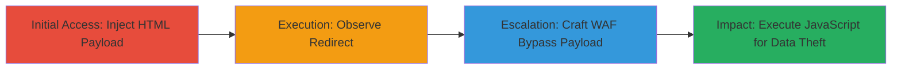

---
tags:
  - xss
  - reflected-xss
  - waf-bypass
  - html-injection
  - open-redirect
  - glassdoor
type: attack_chain
tools:
  - '[[tools/Firefox]]'
  - '[[tools/Chrome]]'
  - '[[tools/PortSwigger-XSS-Cheat-Sheet]]'
tactics:
  - '[[Initial Access]]'
  - '[[Execution]]'
  - '[[Collection]]'
verified: false
platforms:
  - Web
submitted: true
created_at: '2023-10-01T00:00:00Z'
procedures:
  - '[[procedures/Inject-HTML-Payload-for-Open-Redirect-in-Glassdoor-Filter]]'
  - '[[procedures/Observe-Redirect-from-Injected-Meta-Tag]]'
  - '[[procedures/Craft-WAF-Bypassing-XSS-Payload-with-Double-Encoding]]'
  - '[[procedures/Execute-XSS-Payload-to-Trigger-JavaScript-Alert]]'
step_count: 4
techniques:
  - '[[JavaScript]]'
  - '[[Drive-by Compromise]]'
updated_at: '2025-12-13T23:55:38.455Z'
description: >-
  A multi-stage attack exploiting a reflected XSS vulnerability in Glassdoor's
  salary pages through the filter.jobTitleExact parameter, starting with HTML
  injection for open redirects and escalating to WAF-bypassing JavaScript
  execution for potential data theft.
id: 3dd68019-342d-43ce-90d4-9f9d1b9622ba
validated: true
mitre_tactics:
  - '[[Initial Access]]'
  - '[[Execution]]'
  - '[[Collection]]'
mitre_techniques:
  - '[[JavaScript]]'
  - '[[Drive-by Compromise]]'
---
# Reflected XSS via Unsanitized filter.jobTitleExact Parameter on Glassdoor Salary Pages

Multi-stage attack chain demonstrating exploitation of insufficient input sanitization in Glassdoor's salary search functionality, allowing arbitrary HTML and JavaScript injection via URL-encoded payloads in the filter.jobTitleExact parameter. The attack begins with content injection for phishing via open redirects and progresses to bypassing web application firewall (WAF) protections using double HTML and URL encoding to execute JavaScript, potentially leading to session hijacking or credential theft.

## Chain Metrics Dashboard

| Metric | Value |
|--------|-------|
| Chain Status | Unverified |
| Total Steps | 4 |
| Execution Time | ~5 minutes |
| Skill Level | Intermediate |
| Complexity | Medium |
| Impact Level | High |

## Attack Flow Visualization

## Prerequisites & Requirements

### Required Tools

- [[tools/Firefox]]
- [[tools/Chrome]]
- [[tools/PortSwigger-XSS-Cheat-Sheet]]

### Target Environment

- Web platform
- Glassdoor salary pages (e.g., https://www.glassdoor.com/Salary/*)
- No specific ports required; standard HTTPS (443)
- Network access to public internet

### Initial Access Requirements

- No credentials needed; public-facing application
- Direct network access to Glassdoor domain
- No prior access required

## Detailed Attack Procedures

### Step 1: Initial Access
procedure: [[procedures/Inject-HTML-Payload-for-Open-Redirect-in-Glassdoor-Filter]]

**Objective**: Inject a URL-encoded HTML payload into the filter.jobTitleExact parameter to break out of the meta tag context and insert a meta refresh tag for redirection.

**Instructions**: Construct and access a URL with the payload in a web browser. Use a base salary page URL and append the malicious parameter.

**Expected Output**: The page loads with injected HTML in the source, visible upon inspection.

**Success Indicators**:
- Injected meta tag appears in page source
- Redirection occurs to the specified malicious URL

### Step 2: Execution
procedure: [[procedures/Observe-Redirect-from-Injected-Meta-Tag]]

**Objective**: Verify the content injection by observing the automatic redirection triggered by the injected meta tag.

**Instructions**: Load the prepared URL in the browser and monitor the navigation behavior.

**Expected Output**: Browser redirects to the target URL (e.g., https://bit.ly).

**Success Indicators**:
- Page source shows the injected `<meta http-equiv="refresh" content="0; url=//bit.ly">`
- Immediate redirect to external site

### Step 3: Privilege Escalation
procedure: [[procedures/Craft-WAF-Bypassing-XSS-Payload-with-Double-Encoding]]

**Objective**: Develop an advanced payload using double HTML encoding and URL encoding to evade WAF filters and enable JavaScript execution.

**Instructions**: Reference XSS cheat sheets to encode the payload, then integrate it into the URL parameter.

**Expected Output**: Encoded payload ready for injection without triggering WAF blocks.

**Success Indicators**:
- Payload passes through without blocking
- No WAF alerts or errors

### Step 4: Objective
procedure: [[procedures/Execute-XSS-Payload-to-Trigger-JavaScript-Alert]]

**Objective**: Trigger the XSS by accessing the URL with the bypassing payload, executing JavaScript to demonstrate control (e.g., confirm dialog) and potential for stealing sensitive data like cookies.

**Instructions**: Navigate to the final URL in the browser to execute the payload.

**Expected Output**: JavaScript alert or confirm dialog pops up, confirming execution.

**Success Indicators**:
- confirm(1) dialog appears
- Page source reflects the decoded img src onerror handler

## Attack Chain Summary

### Key Achievements

1. Successful HTML injection leading to open redirects for phishing attacks
2. WAF bypass using encoding techniques to inject executable JavaScript
3. Demonstration of potential impacts including cookie theft and credential exfiltration

## Technique & Tactic Coverage

### MITRE ATT&CK Techniques

- [[JavaScript]]
- [[Drive-by Compromise]]

### MITRE ATT&CK Tactics

- [[Initial Access]]
- [[Execution]]
- [[Collection]]

---
*Last updated: 2023-10-01T00:00:00Z*
