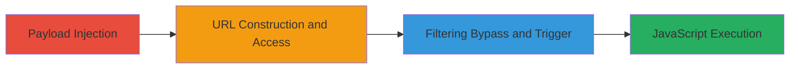

# Reflected XSS via javascript: Protocol Injection in Instacart Partner Recipe URL

Multi-stage attack chain demonstrating a reflected Cross-Site Scripting (XSS) vulnerability in the Instacart partner recipe page, where the recipe_url parameter is unsanitized and reflected into an href attribute, allowing javascript: protocol injection for arbitrary code execution upon user interaction.

## Chain Metrics Dashboard

| Metric | Value |
|--------|-------|
| Chain Status | Unverified |
| Total Steps | 3 |
| Execution Time | ~2 minutes |
| Skill Level | Intermediate |
| Complexity | Low |
| Impact Level | High |

## Attack Flow Visualization

## Prerequisites & Requirements

### Required Tools

- Web browser (e.g., Chrome or Firefox for manual testing)

### Target Environment

- Web application: Instacart partner recipe page at https://www.instacart.com/store/partner_recipe
- No specific ports or services required beyond standard HTTPS (port 443)
- Network access: Public internet access to the target URL

### Initial Access Requirements

- No credentials required
- Attacker must be able to craft and access URLs
- Victim interaction needed (clicking the generated link)

## Detailed Attack Procedures

### Step 1: Payload Injection
procedure: [[procedures/Inject-javascript-Payload-into-recipe_url]]

**Objective**: Construct a malicious URL by injecting a javascript: payload into the recipe_url parameter to simulate a recipe submission that reflects the input into an href attribute.

**Instructions**: Manually craft the URL with the payload in recipe_url and include other parameters to make it appear as a valid recipe. For example, set recipe_url to 'javascript:alert(1)' and add details like partner_name, ingredients, title, description, and image_url.

**Expected Output**: A generated partner recipe page displaying the injected content in a link (e.g., recipe image href).

**Success Indicators**:
- Payload reflected in the page source as an href attribute
- No immediate errors in URL loading

### Step 2: Trigger XSS Execution
procedure: [[procedures/Trigger-XSS-via-Link-Click]]

**Objective**: Access the crafted URL and interact with the reflected element to execute the injected JavaScript in the browser context.

**Instructions**: Open the full URL in a browser, such as https://www.instacart.com/store/partner_recipe?recipe_url=javascript:alert(1)&partner_name=&ingredients%5B%5D=apples&ingredients%5B%5D=butter&ingredients%5B%5D=Splenda+Brown+Sugar+Blend&ingredients%5B%5D=cinnamon&ingredients%5B%5D=nutmeg&title=Barb%27s+Fried+Apples+-Diabetic-Low+Fat&description=&image_url=%2Fassets%2Fimg%2Fno-recipe-image.jpg. Locate and click the reflected link, like the recipe image titled 'Barb's Fried Apples -Diabetic-Low Fat'.

**Expected Output**: Alert box or JavaScript execution (e.g., alert(1) pops up).

**Success Indicators**:
- JavaScript executes upon click
- Alert or console log confirms payload run

### Step 3: Bypass Filtering
procedure: [[procedures/Bypass-Filtering-with-URL-Fragment]]

**Objective**: Modify the payload to evade any basic sanitization checks that might block plain javascript: injections by appending a valid URL fragment.

**Instructions**: Update the recipe_url parameter to 'javascript:alert(1)//https://example.com' in the crafted URL and repeat the access and click steps from previous procedures.

**Expected Output**: Successful execution despite potential filters, with the appended fragment making it appear as a valid href.

**Success Indicators**:
- Payload executes without being stripped
- No filtering errors or blocks

## Attack Chain Summary

### Key Achievements

1. Identified and exploited unsanitized reflection of recipe_url into href attributes
2. Achieved arbitrary JavaScript execution via user-click interaction
3. Bypassed basic filtering using URL comment syntax for robustness

## Technique & Tactic Coverage

### MITRE ATT&CK Techniques

- [[JavaScript]]

### MITRE ATT&CK Tactics

- [[Initial Access]]
- [[Execution]]
- [[Collection]]

---
*Last updated: 2023-10-01T12:00:00Z*
