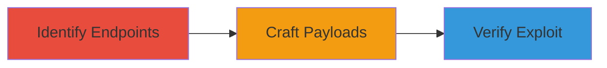

---
tags:
  - xss
  - reflected-xss
  - web-vulnerability
type: attack_chain
tools: []
tactics:
  - '[[Initial Access]]'
  - '[[Execution]]'
commands:
  - '[[commands/inject-xss-payload]]'
platforms:
  - Web
complexity: low
procedures:
  - '[[procedures/Identify-Vulnerable-Endpoints-for-XSS]]'
  - '[[procedures/Craft-and-Test-XSS-Payloads]]'
  - '[[procedures/Verify-and-Report-XSS-Vulnerability]]'
step_count: 3
techniques:
  - '[[Exploit Public-Facing Application]]'
  - '[[JavaScript]]'
description: >-
  Multi-stage attack chain exploiting a reflected XSS vulnerability in the
  miniUrl parameter of HackerOne's resources endpoints to execute arbitrary
  JavaScript.
skill_level: beginner
impact_level: low
id: 7ded4231-57c2-4193-b4b2-cf4b15d521e2
created_at: '2025-12-14T00:11:25.189Z'
updated_at: '2025-12-14T00:11:25.189Z'
verified: false
validated: true
submitted: true
mitre_tactics:
  - '[[Initial Access]]'
  - '[[Execution]]'
mitre_techniques:
  - '[[Exploit Public-Facing Application]]'
  - '[[JavaScript]]'
---
# Reflected XSS via miniUrl Parameter on HackerOne Resources Endpoints

Multi-stage attack chain demonstrating the discovery and exploitation of a reflected XSS vulnerability on HackerOne's marketing sites, allowing arbitrary JavaScript execution in the victim's browser. The attack involves identifying vulnerable endpoints, crafting payloads, and verifying the exploit, with low overall impact due to the non-critical nature of the affected sites.

## Chain Metrics Dashboard

| Metric | Value |
|--------|-------|
| Chain Status | Unverified |
| Total Steps | 3 |
| Execution Time | ~5 minutes |
| Skill Level | Beginner |
| Complexity | Low |
| Impact Level | Low |

## Attack Flow Visualization



## Prerequisites & Requirements

### Required Tools

- None (browser-based testing)

### Target Environment

- Web platform
- Access to endpoints: https://www.hackerone.com/resources/ and https://resources.hackerone.com/
- No specific ports or services required

### Initial Access Requirements

- Public internet access
- No credentials needed

## Detailed Attack Procedures

### Step 1: Identify Vulnerable Endpoints
procedure: [[procedures/Identify-Vulnerable-Endpoints-for-XSS]]

**Objective**: Discover endpoints that accept user input via the miniUrl parameter, setting the stage for XSS testing.

**Instructions**: Manually or through brute-force exploration, identify the /resources/read/embed_mini/ endpoints on www.hackerone.com and resources.hackerone.com that process the miniUrl parameter.

**Expected Output**: List of vulnerable URLs ready for payload injection.

**Success Indicators**:
- Endpoints confirmed to accept miniUrl parameter
- No immediate blocking observed

### Step 2: Craft and Test XSS Payloads
procedure: [[procedures/Craft-and-Test-XSS-Payloads]]

**Objective**: Develop and inject payloads to break out of the script context and execute JavaScript.

**Instructions**: Craft a payload such as 'http://example.com\"\",})</script><svg onload=confirm(location)>' and inject it into the miniUrl parameter using a tool like a web browser or [[commands/inject-xss-payload]]. For example:

```bash
curl "https://www.hackerone.com/resources/read/embed_mini/?miniUrl=http://example.com%22%22%2C})%3C%2Fscript%3E%3Csvg%20onload%3Dconfirm(location)%3E"
```

Test multiple variations to confirm breakout from the context.

**Expected Output**: Execution of JavaScript, such as a confirm dialog displaying the location.

**Success Indicators**:
- Payload executes intermittently
- JavaScript confirmation observed

### Step 3: Verify and Report XSS Vulnerability
procedure: [[procedures/Verify-and-Report-XSS-Vulnerability]]

**Objective**: Confirm the vulnerability's reliability and document it for reporting.

**Instructions**: Re-test the payload across sessions to observe intermittent execution (possibly due to cookies or IP-based protections). Capture screenshots and proof-of-concept URLs, then report to the vendor.

**Expected Output**: Documentation of the exploit, including intermittent success rates.

**Success Indicators**:
- Vulnerability confirmed with evidence
- Report submitted and remediated by vendor

## Attack Chain Summary

### Key Achievements

1. Discovery of injectable parameter in public endpoints
2. Successful JavaScript execution via reflected XSS
3. Low-impact exploit on marketing sites leading to remediation

## Technique & Tactic Coverage

### MITRE ATT&CK Techniques

- [[Exploit Public-Facing Application]]
- [[JavaScript]]

### MITRE ATT&CK Tactics

- [[Initial Access]]
- [[Execution]]

*Last updated: 2023-10-01*
