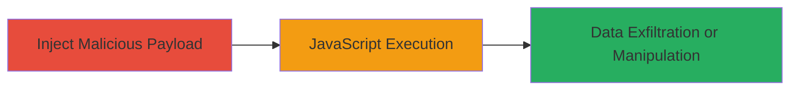

# Reflected XSS via msgId Parameter in WSO2 Carbon Admin Login

Multi-stage attack chain demonstrating a complete attack workflow.

The vulnerability is a reflected Cross-Site Scripting (XSS) in the 'msgId' parameter of the login page at https://api.mtn.sd/carbon/admin/login.jsp, assigned CVE-2020-17453. Attackers inject a JavaScript payload into the parameter, which is reflected without sanitization, executing on page load. This allows arbitrary JavaScript execution in the victim's browser, enabling session cookie theft, page rewriting, or phishing.

## Chain Metrics Dashboard

| Metric | Value |
|--------|-------|
| Chain Status | Unverified |
| Total Steps | 1 |
| Execution Time | ~1 minute |
| Skill Level | Beginner |
| Complexity | Low |
| Impact Level | High |

## Attack Flow Visualization



## Prerequisites & Requirements

### Required Tools

- Browser (e.g., Chrome, Firefox) or [[tools/curl]]

### Target Environment

- Web platform
- WSO2 Carbon application (Java/JSP-based)
- Accessible login page at https://api.mtn.sd/carbon/admin/login.jsp

### Initial Access Requirements

- Ability to send a malicious link to the victim (e.g., via email or social engineering)
- No authentication required for the login page
- Victim must visit the crafted URL in their browser

## Detailed Attack Procedures

### Step 1: Payload Injection and Execution
procedure: [[procedures/Exploit-Reflected-XSS-in-msgId-Parameter]]

**Objective**: Inject a JavaScript payload into the msgId parameter to execute arbitrary code in the victim's browser upon page load.

**Instructions**: Craft a URL with the URL-encoded payload and direct the victim to access it. For testing, use a browser or [[commands/curl-reflected-xss-test]] to verify execution:

```bash
curl "https://api.mtn.sd/carbon/admin/login.jsp?msgId=%27%3Balert(%27XSS%27)%2F%2F" -v
```

In a real attack, send the link https://api.mtn.sd/carbon/admin/login.jsp?msgId=%27%3Balert(%27Renzi%27)%2F%2F to the victim. Upon clicking, the payload ';alert('Renzi')//' executes, confirming the vulnerability.

**Expected Output**: JavaScript alert box pops up (in browser) or reflected payload in response (via curl), indicating execution.

**Success Indicators**:
- Alert or custom JS behavior observed in browser
- No server-side errors; payload reflected unsanitized
- Potential for further payloads to steal cookies via document.cookie

## Attack Chain Summary

### Key Achievements

1. Successful injection and execution of JavaScript payload via reflected XSS
2. Demonstration of arbitrary code execution in victim context
3. Potential for session hijacking or data theft

## Technique & Tactic Coverage

### MITRE ATT&CK Techniques

- [[JavaScript]]
- [[Keylogging]]

### MITRE ATT&CK Tactics

- [[Execution]]
- [[Collection]]

---
*Last updated: 2023-10-01T00:00:00Z*
