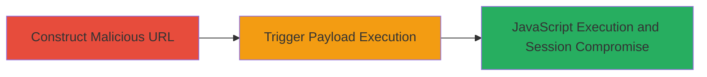

# Reflected XSS via next_url Parameter in Pixiv Sketch Account Resignation Page

Multi-stage attack chain demonstrating a complete reflected XSS exploit on the Pixiv Sketch platform, leading to arbitrary JavaScript execution in the victim's browser and potential session compromise.

## Chain Metrics Dashboard

| Metric | Value |
|--------|-------|
| Chain Status | Unverified |
| Total Steps | 2 |
| Execution Time | ~1 minute |
| Skill Level | Intermediate |
| Complexity | Medium |
| Impact Level | High |

## Attack Flow Visualization

## Prerequisites & Requirements

### Required Tools

- Web browser (e.g., Chrome, Firefox)

### Target Environment

- Web platform
- Access to https://sketch.pixiv.net
- Victim must have initiated account resignation process

### Initial Access Requirements

- No credentials required for the success page access
- Network access to the internet
- Social engineering to trick victim into visiting the malicious URL post-resignation

## Detailed Attack Procedures

### Step 1: Construct Malicious URL
procedure: [[procedures/Construct-Malicious-next_url-for-XSS]]

**Objective**: Craft a URL with a javascript: payload in the next_url parameter to inject executable code into the reflected context on the resignation success page.

**Instructions**: Manually construct the URL by appending the encoded javascript payload to the base success endpoint. Use URL encoding for the payload to bypass basic filters.

**Expected Output**: A fully formed URL like https://sketch.pixiv.net/resign_request/success?next_url=javascript%3Aalert%2F%2F(document.domain).

**Success Indicators**:
- URL is valid and accessible
- Payload is properly encoded without breaking the URL structure

### Step 2: Trigger XSS Payload Execution
procedure: [[procedures/Trigger-XSS-Payload-on-Resignation-Page]]

**Objective**: Deliver the malicious URL to the victim and trigger the payload execution via page load or button click, resulting in JavaScript alert or further exploitation.

**Instructions**: Have the victim visit the crafted URL after completing account resignation. The payload executes on page load or when clicking the 'Back To Page' button.

**Expected Output**: Alert box displaying the document domain (e.g., sketch.pixiv.net) or execution of custom JavaScript for data theft.

**Success Indicators**:
- JavaScript alert pops up
- Console logs confirm payload execution
- Potential cookie theft or session hijacking if payload is extended

## Attack Chain Summary

### Key Achievements

1. Successful injection of javascript: URI into next_url parameter
2. Reflection and execution of arbitrary JavaScript in victim browser
3. Potential compromise of user session, including cookie theft and unauthorized actions

## Technique & Tactic Coverage

### MITRE ATT&CK Techniques

- [[JavaScript]]
- [[Exploit Public-Facing Application]]

### MITRE ATT&CK Tactics

- [[Execution]]
- [[Initial Access]]

---
*Last updated: 2023-10-01T00:00:00Z*
