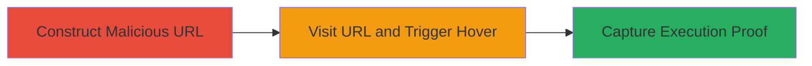

# Reflected XSS via onmouseover in Zomato Restaurant URL Path

Multi-stage attack chain demonstrating a complete reflected XSS workflow targeting Zomato's restaurant listing endpoint.

## Chain Metrics Dashboard

| Metric | Value |
|--------|-------|
| Chain Status | Unverified |
| Total Steps | 3 |
| Execution Time | ~2 minutes |
| Skill Level | Intermediate |
| Complexity | Medium |
| Impact Level | High |

## Attack Flow Visualization

## Prerequisites & Requirements

### Required Tools

- Web browser (e.g., Firefox)

### Target Environment

- Web platform
- Access to Zomato's restaurant listing page (e.g., https://www.zomato.com/cs/new-york-city/turtle-bay-restaurants/fast-casual/{restaurant_id})
- No authentication required

### Initial Access Requirements

- Public internet access
- Valid restaurant ID (e.g., '1zqjrw')
- No prior credentials needed

## Detailed Attack Procedures

### Step 1: Construct Malicious URL
procedure: [[procedures/Inject-and-Trigger-onmouseover-XSS-in-URL-Path]]

**Objective**: Craft a URL that injects an onmouseover JavaScript payload into the restaurant ID parameter, exploiting lack of sanitization in the path.

**Instructions**: Manually construct the URL by appending the payload to a valid restaurant ID. Use the base URL https://www.zomato.com/cs/new-york-city/turtle-bay-restaurants/fast-casual/ followed by the restaurant ID '1zqjrw' and the payload '/onmouseover=\'alert(1)\'/style=\'height:200;width:200\'/b=' encoded as needed for the browser.

The full malicious URL is: https://www.zomato.com/cs/new-york-city/turtle-bay-restaurants/fast-casual/1zqjrw'/onmouseover='alert%281%29'/style='height:200;width:200'/b=

**Expected Output**: A valid URL that, when visited, renders a link with the injected attributes reflected in the page.

**Success Indicators**:
- URL is accessible without errors
- Page loads with a link element containing the injected onmouseover attribute

### Step 2: Visit URL and Trigger Hover
procedure: [[procedures/Inject-and-Trigger-onmouseover-XSS-in-URL-Path]]

**Objective**: Access the malicious URL in a browser and hover over the reflected link to execute the injected JavaScript.

**Instructions**: Open the constructed URL in Firefox. Locate the reflected link on the restaurant listing page and hover the mouse over it to trigger the onmouseover event.

**Expected Output**: An alert box pops up displaying '1', confirming JavaScript execution in the victim's browser context.

**Success Indicators**:
- Alert dialog appears on hover
- No browser errors; script executes cleanly

### Step 3: Capture Proof of Execution
procedure: [[procedures/Inject-and-Trigger-onmouseover-XSS-in-URL-Path]]

**Objective**: Document the successful XSS execution for verification.

**Instructions**: While the alert is displayed, take a screenshot of the browser window showing the URL, the hovered link, and the alert popup.

**Expected Output**: A screenshot image file capturing the alert triggered by the hover event.

**Success Indicators**:
- Screenshot clearly shows the alert and context
- Payload execution is visually confirmed

## Attack Chain Summary

### Key Achievements

1. Successfully injected HTML attributes into the URL path without sanitization
2. Triggered arbitrary JavaScript execution via onmouseover event
3. Demonstrated potential for session hijacking or data theft in a real-world web application

## Technique & Tactic Coverage

### MITRE ATT&CK Techniques

- [[JavaScript]]
- [[Exploit Public-Facing Application]]

### MITRE ATT&CK Tactics

- [[Execution]]
- [[Collection]]

---
*Last updated: 2023-10-01T00:00:00Z*
