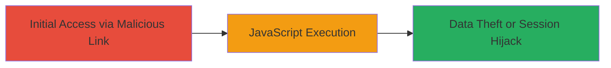

---
tags:
  - xss
  - reflected-xss
  - javascript
  - web-vulnerability
type: attack_chain
tools: []
tactics:
  - '[[Execution]]'
verified: false
platforms:
  - Web
submitted: true
complexity: low
created_at: '2023-10-01T00:00:00Z'
procedures:
  - '[[procedures/Exploit-Reflected-XSS-in-paymentProviderOffset]]'
step_count: 1
techniques:
  - '[[JavaScript]]'
updated_at: '2025-12-13T23:52:38.898Z'
description: >-
  A reflected XSS attack exploiting insufficient input validation in the
  paymentProviderOffset parameter on terra-6.indriverapp.com, allowing arbitrary
  JavaScript execution in users' browsers.
skill_level: beginner
impact_level: high
id: 4de765ac-6809-4a34-9176-357fe1ccb8b6
validated: true
mitre_tactics:
  - '[[Execution]]'
mitre_techniques:
  - '[[JavaScript]]'
---
# Reflected XSS via paymentProviderOffset Parameter on inDrive

Multi-stage attack chain demonstrating a complete attack workflow exploiting a reflected XSS vulnerability in the inDrive application.

## Chain Metrics Dashboard

| Metric | Value |
|--------|-------|
| Chain Status | Unverified |
| Total Steps | 1 |
| Execution Time | ~1 minute |
| Skill Level | Beginner |
| Complexity | Low |
| Impact Level | High |

## Attack Flow Visualization

## Prerequisites & Requirements

### Required Tools

- Web browser (e.g., Chrome, Firefox)

### Target Environment

- Web platform
- Access to terra-6.indriverapp.com domain
- No specific services or ports required beyond standard HTTP/HTTPS (80/443)

### Initial Access Requirements

- Ability to craft and send URLs with malicious parameters
- Victim interaction (e.g., clicking a phishing link)
- No prior credentials or network position needed

## Detailed Attack Procedures

### Step 1: Inject and Trigger XSS Payload
procedure: [[procedures/Exploit-Reflected-XSS-in-paymentProviderOffset]]

**Objective**: Inject a JavaScript payload into the paymentProviderOffset parameter to execute arbitrary code in the victim's browser upon page load.

**Instructions**: Construct a URL targeting the vulnerable endpoint on terra-6.indriverapp.com with a reflected XSS payload in the paymentProviderOffset parameter. A common payload for testing is ``. For example, append `?paymentProviderOffset=` to the base URL (redacted as ███████ in the report). Send this URL to a victim via phishing or social engineering, or test directly in a browser.

Upon accessing the URL, the payload reflects back unsanitized, executing the JavaScript and triggering an alert popup.

**Expected Output**: An alert dialog box appears in the browser displaying 'XSS', confirming successful payload execution.

**Success Indicators**:
- Alert popup or console log from the injected script
- Ability to execute more complex payloads, such as stealing cookies via `document.cookie`

## Attack Chain Summary

### Key Achievements

1. Successful injection and reflection of JavaScript payload
2. Arbitrary code execution in the context of the victim's browser session
3. Potential for session hijacking, data exfiltration, or phishing escalation

## Technique & Tactic Coverage

### MITRE ATT&CK Techniques

- [[JavaScript]]

### MITRE ATT&CK Tactics

- [[Execution]]

---
*Last updated: 2023-10-01T00:00:00Z*
