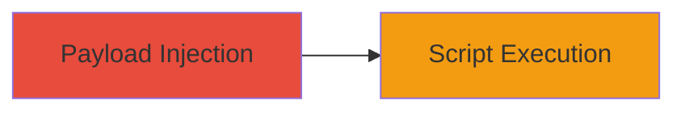

# Reflected XSS via return_url Parameter in TikTok Endpoint

Multi-stage attack chain demonstrating a complete attack workflow.

## Chain Metrics Dashboard

| Metric | Value |
|--------|-------|
| Chain Status | Unverified |
| Total Steps | 1 |
| Execution Time | ~1 minutes |
| Skill Level | Beginner |
| Complexity | Low |
| Impact Level | Medium |

## Attack Flow Visualization



## Prerequisites & Requirements

### Required Tools

- Browser or [[tools/curl]]

### Target Environment

- Web platform
- Access to TikTok endpoint handling return_url parameter
- No specific ports or services required beyond HTTP/HTTPS

### Initial Access Requirements

- No credentials needed
- Victim must click malicious link
- Network access to tiktok.com

## Detailed Attack Procedures

### Step 1: Inject XSS Payload
procedure: [[procedures/Exploit-Reflected-XSS-in-return-url-Parameter]]

**Objective**: Deliver a malicious URL to the victim that triggers reflected XSS via the return_url parameter, executing arbitrary JavaScript in the browser context on tiktok.com.

**Instructions**: Craft a URL with a malicious payload in the return_url parameter. For example, use a simple alert script to test execution. Send the link to the victim via phishing or social engineering.

Use [[commands/curl-send-xss-payload]] to simulate the request if testing in a controlled environment:

```bash
curl "https://www.tiktok.com/some-endpoint?return_url=javascript:alert('XSS')"
```

In a real attack, the victim accesses the crafted URL directly in their browser.

**Expected Output**: Upon access, the browser executes the script, e.g., popping an alert box confirming XSS.

**Success Indicators**:
- Script executes in victim's browser
- Alert or other payload effect visible on tiktok.com context

## Attack Chain Summary

### Key Achievements

1. Successful injection of arbitrary JavaScript via reflected parameter
2. Script execution within tiktok.com domain
3. Potential for session hijacking or data theft (medium impact)

## Technique & Tactic Coverage

### MITRE ATT&CK Techniques

- [[JavaScript]]

### MITRE ATT&CK Tactics

- [[Execution]]

---
*Last updated: 2023-10-01T00:00:00Z*
