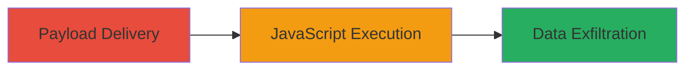

---
tags:
  - xss
  - reflected-xss
  - revive-adserver
  - javascript-injection
type: attack_chain
tools: []
tactics:
  - '[[Initial Access]]'
  - '[[Collection]]'
verified: false
platforms:
  - Web
  - PHP
submitted: true
complexity: medium
created_at: '2023-10-01T00:00:00Z'
procedures:
  - '[[procedures/Exploit-Reflected-XSS-in-statsBreakdown-Parameter]]'
step_count: 1
techniques:
  - '[[JavaScript]]'
  - '[[Exploit Public-Facing Application]]'
updated_at: '2025-12-14T03:16:36.843Z'
description: >-
  A multi-stage attack exploiting a reflected XSS vulnerability in the Revive
  Adserver admin stats endpoint to execute JavaScript in the victim's browser,
  enabling session hijacking or data theft.
skill_level: intermediate
impact_level: high
id: bb9433e1-e2e5-4ceb-b0ad-777bc434e227
validated: true
mitre_tactics:
  - '[[Initial Access]]'
  - '[[Collection]]'
mitre_techniques:
  - '[[JavaScript]]'
  - '[[Exploit Public-Facing Application]]'
---
# Reflected XSS via statsBreakdown Parameter in Revive Adserver Admin Panel

Multi-stage attack chain demonstrating a complete attack workflow exploiting a reflected XSS in Revive Adserver 5.1.1 to execute arbitrary JavaScript in an authenticated admin's browser context.

## Chain Metrics Dashboard

| Metric | Value |
|--------|-------|
| Chain Status | Unverified |
| Total Steps | 1 |
| Execution Time | ~2 minutes |
| Skill Level | Intermediate |
| Complexity | Medium |
| Impact Level | High |

## Attack Flow Visualization



## Prerequisites & Requirements

### Required Tools

- Web browser (e.g., Firefox for accesskey triggering)

### Target Environment

- Revive Adserver version 5.1.1 or vulnerable equivalents
- Web platform with PHP backend
- Access to /admin/stats.php endpoint (requires tricking an authenticated admin)

### Initial Access Requirements

- Ability to send a malicious URL to an admin user (e.g., via phishing email)
- No direct credentials needed; relies on social engineering for the victim to visit the link while authenticated
- Network access to the adserver instance

## Detailed Attack Procedures

### Step 1: Deliver and Trigger XSS Payload
procedure: [[procedures/Exploit-Reflected-XSS-in-statsBreakdown-Parameter]]

**Objective**: Inject a JavaScript payload into the statsBreakdown parameter, reflect it into the admin page, and trigger execution to steal cookies or perform other malicious actions.

**Instructions**: Construct a malicious URL with the XSS payload targeting the /admin/stats.php endpoint. The payload uses an onclick event tied to an accesskey for execution. Send this URL to an admin user via email or other means. Once the admin visits the page while authenticated, the payload reflects in a hidden input field. Trigger execution by pressing Alt+Shift+X (in Firefox) to activate the accesskey.

Example malicious URL:

```url
http://revive-adserver.loc/admin/stats.php?statsBreakdown=day%27%20onclick=alert(document.domain)%20accesskey=X%20&listorder=key&orderdirection=up&day=&setPerPage=15&entity=global&breakdown=history&period_preset=last_month&period_start=01+December+2020&period_end=31+December+2020
```

Replace the domain and adjust parameters as needed for the target instance.

**Expected Output**: Upon triggering (Alt+Shift+X), an alert box displays the document domain, confirming JavaScript execution. In a real attack, replace alert() with code to exfiltrate cookies (e.g., via fetch to attacker server) or redirect to a phishing site.

**Success Indicators**:
- Payload reflected in the page source as `<input ... value="day' onclick=alert(document.domain) accesskey=X">`
- Alert or malicious action triggers on accesskey press
- Admin session cookies captured or malicious redirect occurs

## Attack Chain Summary

### Key Achievements

1. Successful reflection of unsanitized user input into HTML attributes
2. Execution of arbitrary JavaScript in the admin browser context
3. Potential for session hijacking, cookie theft, or phishing attacks

## Technique & Tactic Coverage

### MITRE ATT&CK Techniques

- [[JavaScript]]
- [[Exploit Public-Facing Application]]

### MITRE ATT&CK Tactics

- [[Initial Access]]
- [[Collection]]

---
*Last updated: 2023-10-01T00:00:00Z*
