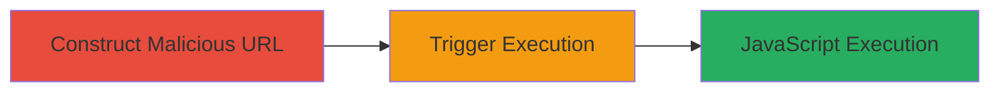

---
tags:
  - xss
  - reflected-xss
  - web
  - javascript
  - session-hijacking
type: attack_chain
tools: []
tactics:
  - '[[Initial Access]]'
  - '[[Execution]]'
  - '[[Collection]]'
verified: false
platforms:
  - Web
submitted: true
complexity: low
created_at: '2023-10-01T00:00:00Z'
procedures:
  - '[[procedures/Construct-Malicious-URL-with-XSS-Payload-in-utm-source]]'
  - '[[procedures/Trigger-and-Verify-XSS-Execution]]'
step_count: 2
techniques:
  - '[[Exploit Public-Facing Application]]'
  - '[[JavaScript]]'
updated_at: '2025-12-13T23:52:33.633Z'
description: >-
  A multi-step attack chain exploiting a reflected XSS vulnerability in the
  utm_source parameter of the Starbucks UK eGift page, allowing arbitrary
  JavaScript execution to steal session cookies or perform other client-side
  attacks.
skill_level: beginner
impact_level: high
id: 81701cea-6047-43ea-8bcd-2bd427992998
validated: true
mitre_tactics:
  - '[[Initial Access]]'
  - '[[Execution]]'
  - '[[Collection]]'
mitre_techniques:
  - '[[Exploit Public-Facing Application]]'
  - '[[JavaScript]]'
---
# Reflected XSS via utm_source Parameter on Starbucks UK eGift Page

Multi-stage attack chain demonstrating a complete reflected XSS workflow on the Starbucks UK eGift page.

## Chain Metrics Dashboard

| Metric | Value |
|--------|-------|
| Chain Status | Unverified |
| Total Steps | 2 |
| Execution Time | ~1 minute |
| Skill Level | Beginner |
| Complexity | Low |
| Impact Level | High |

## Attack Flow Visualization

## Prerequisites & Requirements

### Required Tools

- Web browser (e.g., Chrome, Firefox)

### Target Environment

- Web platform
- Access to https://www.starbucks.co.uk/shop/card/egift
- No special services or ports required beyond standard HTTPS (443)

### Initial Access Requirements

- Public internet access
- No credentials needed
- Victim must visit the malicious URL

## Detailed Attack Procedures

### Step 1: Construct Malicious URL
procedure: [[procedures/Construct-Malicious-URL-with-XSS-Payload-in-utm-source]]

**Objective**: Create a URL with an injected XSS payload in the utm_source parameter to close an HTML attribute and inject an event handler.

**Instructions**: Encode the payload ">%3c b onbeforescriptexecute=prompt(document.domain)%3e and append it to the utm_source parameter in the target URL. The full URL becomes: https://www.starbucks.co.uk/shop/card/egift?utm_source=%3e%3cb%20onbeforescriptexecute=prompt(document.domain)%3e

**Expected Output**: A crafted URL ready for access.

**Success Indicators**:
- URL is valid and accessible without errors
- Payload is properly URL-encoded

### Step 2: Trigger and Verify XSS Execution
procedure: [[procedures/Trigger-and-Verify-XSS-Execution]]

**Objective**: Access the malicious URL to trigger the payload and confirm JavaScript execution by displaying the document domain.

**Instructions**: Open the crafted URL in a web browser. Upon page load, the onbeforescriptexecute event should fire, prompting the domain name.

**Expected Output**: A browser prompt displaying 'www.starbucks.co.uk'.

**Success Indicators**:
- JavaScript alert or prompt appears
- Document domain is revealed, confirming arbitrary code execution

## Attack Chain Summary

### Key Achievements

1. Successful injection of XSS payload into utm_source parameter
2. Reflection of unsanitized input leading to HTML attribute closure and event handler injection
3. Confirmation of JavaScript execution capability for potential session theft or defacement

## Technique & Tactic Coverage

### MITRE ATT&CK Techniques

- [[Exploit Public-Facing Application]]
- [[JavaScript]]

### MITRE ATT&CK Tactics

- [[Initial Access]]
- [[Execution]]
- [[Collection]]

---
*Last updated: 2023-10-01T00:00:00Z*
