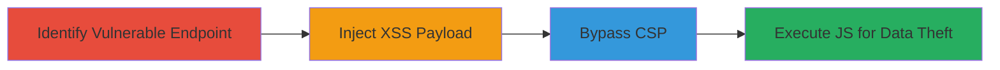

# Reflected XSS with CSP Bypass in PayPal Currency Converter for Data Theft

Multi-stage attack chain demonstrating exploitation of a reflected XSS vulnerability in the PayPal business wallet currency converter endpoint, followed by bypassing Content Security Policy (CSP) to execute injected JavaScript, enabling theft of user session data or cookies.

## Chain Metrics Dashboard

| Metric | Value |
|--------|-------|
| Chain Status | Unverified |
| Total Steps | 2 |
| Execution Time | ~5 minutes |
| Skill Level | Intermediate |
| Complexity | Medium |
| Impact Level | High |

## Attack Flow Visualization

## Prerequisites & Requirements

### Required Tools

- Browser with developer tools (e.g., Chrome DevTools)
- Optional: Proxy tool like Burp Suite for payload crafting

### Target Environment

- Web platform
- Access to https://www.paypal.com/businesswallet/currencyConverter/
- No specific ports or services beyond standard HTTPS (443)

### Initial Access Requirements

- Public access to the PayPal website
- No credentials needed for initial testing
- Victim must visit the crafted malicious URL

## Detailed Attack Procedures

### Step 1: Identify and Exploit Reflected XSS
procedure: [[procedures/Exploit-Reflected-XSS-in-URL-Parameter]]

**Objective**: Locate the vulnerable URL parameter in the currency converter endpoint and inject a malicious JavaScript payload that reflects back into the page DOM.

**Instructions**: Navigate to the target endpoint https://www.paypal.com/businesswallet/currencyConverter/ and identify the unsanitized parameter (e.g., a query string like ?amount=). Craft a payload such as  and append it to the URL, e.g., https://www.paypal.com/businesswallet/currencyConverter/?amount=. Use browser dev tools to inspect the response and confirm reflection without sanitization.

**Expected Output**: The payload appears in the page source and may trigger an alert if CSP allows, or fail silently.

**Success Indicators**:
- Payload reflected in HTML response
- JavaScript execution (if no CSP block)

### Step 2: Bypass CSP and Execute Payload
procedure: [[procedures/Bypass-CSP-for-XSS-Payload-Execution]]

**Objective**: Circumvent the site's Content Security Policy to allow the injected XSS payload to execute, enabling malicious actions like stealing cookies or session data.

**Instructions**: Analyze the CSP header using browser dev tools (Network tab > Headers). Identify bypass opportunities, such as using inline scripts or JSONP endpoints if allowed. Modify the payload to exploit the weakness, e.g., injecting via a allowed source like 'unsafe-inline' or a misconfigured directive. Test with an advanced payload like  and confirm execution.

**Expected Output**: Malicious JavaScript runs, exfiltrating data to attacker-controlled server without CSP violation errors in console.

**Success Indicators**:
- No CSP violation in browser console
- Payload executes (e.g., network request to attacker server)
- Potential data theft confirmed via logs on attacker side

## Attack Chain Summary

### Key Achievements

1. Successful injection of reflected XSS payload into PayPal's currency converter.
2. Effective CSP bypass allowing script execution despite security headers.
3. Demonstrated potential for session hijacking or user data theft.

## Technique & Tactic Coverage

### MITRE ATT&CK Techniques

- [[Exploit Public-Facing Application]]
- [[JavaScript]]

### MITRE ATT&CK Tactics

- [[Initial Access]]
- [[Execution]]

---
*Last updated: 2023-10-01T00:00:00Z*
