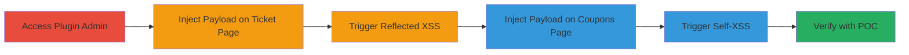

# Reflected and Self-XSS in Camptix Event Ticketing Plugin via Ticket Title Field

Multi-stage attack chain demonstrating XSS vulnerabilities in the Camptix Event Ticketing Plugin for WordPress, allowing arbitrary JavaScript execution through the unsanitized Ticket Title field.

## Chain Metrics Dashboard

| Metric | Value |
|--------|-------|
| Chain Status | Unverified |
| Total Steps | 3 |
| Execution Time | ~5 minutes |
| Skill Level | Beginner |
| Complexity | Low |
| Impact Level | Medium |

## Attack Flow Visualization

## Prerequisites & Requirements

### Required Tools

- Web browser with developer tools
- Access to WordPress admin panel with Camptix plugin enabled

### Target Environment

- WordPress site with Camptix Event Ticketing Plugin installed (version vulnerable, e.g., pre-patch)
- Required services: Web server running PHP and WordPress
- Network access: Direct access to the site as an authenticated user (e.g., admin or event organizer)

### Initial Access Requirements

- Valid WordPress credentials for creating/editing tickets and coupons
- No prior network position needed; local or remote access to the site

## Detailed Attack Procedures

### Step 1: Inject Payload for Reflected XSS on Ticket Page
procedure: [[procedures/Reflected-XSS-via-Ticket-Title-on-Ticket-Page]]

**Objective**: Inject a malicious script into the Ticket Title field to enable reflected XSS when the ticket page is viewed by a victim.

**Instructions**: Log in to the WordPress admin, navigate to the Camptix ticket creation/editing interface, and enter a payload like `` in the Ticket Title field. Save the ticket and view the ticket page to trigger execution.

**Expected Output**: Alert box or script execution in the browser console when the ticket page loads.

**Success Indicators**:
- JavaScript payload executes without errors
- No sanitization visible in the reflected output

### Step 2: Inject Payload for Self-XSS on Coupons Page
procedure: [[procedures/Self-XSS-via-Ticket-Title-on-Coupons-Page]]

**Objective**: Inject a malicious script into the Ticket Title field to execute in the attacker's own browser session on the coupons page.

**Instructions**: In the WordPress admin, edit a ticket's title with a payload such as ``, then navigate to the coupons page associated with that ticket to trigger self-execution.

**Expected Output**: Script runs in the current browser session, potentially displaying cookies or performing other actions.

**Success Indicators**:
- Payload executes only in the attacker's session
- Visible impact like cookie theft in console

### Step 3: Verify Exploitation with Proof-of-Concept
procedure: [[procedures/Verify-XSS-with-Proof-of-Concept]]

**Objective**: Document and reproduce the vulnerabilities using a video or screenshots to confirm impact.

**Instructions**: Record the injection and execution steps using screen capture tools, demonstrating payload entry, page load, and script alert. Test with more advanced payloads like those stealing cookies via `document.cookie`.

**Expected Output**: Video or logs showing successful XSS triggers in both contexts.

**Success Indicators**:
- Reproduction matches the original report
- Potential for session hijacking or phishing demonstrated

## Attack Chain Summary

### Key Achievements

1. Successful injection and reflection of XSS payloads on the ticket page, enabling victim-side execution.
2. Triggered self-XSS on the coupons page, limited to attacker session but combinable with social engineering.
3. Validated vulnerabilities with proof-of-concept, highlighting risks like cookie theft and phishing.

## Technique & Tactic Coverage

### MITRE ATT&CK Techniques

- [[Drive-by Compromise]]
- [[JavaScript]]

### MITRE ATT&CK Tactics

- [[Execution]]

---

*Last updated: 2023-10-01T00:00:00Z*
