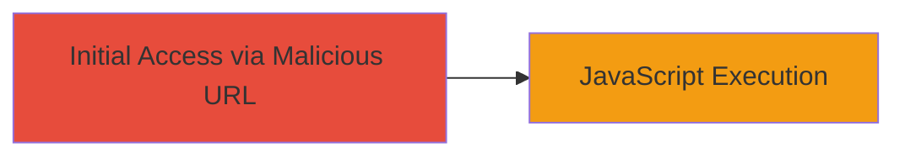

# Reflective XSS Exploitation in Slack URL Redirection for JavaScript Execution in IE

Multi-stage attack chain demonstrating a complete attack workflow.

## Chain Metrics Dashboard

| Metric | Value |
|--------|-------|
| Chain Status | Unverified |
| Total Steps | 1 |
| Execution Time | ~1 minute |
| Skill Level | Beginner |
| Complexity | Low |
| Impact Level | Low |

## Attack Flow Visualization

## Prerequisites & Requirements

### Required Tools

- Web browser (vulnerable Internet Explorer version)

### Target Environment

- Web platform
- Access to Slack's public /go/ endpoint
- No specific services/ports required beyond HTTP/HTTPS

### Initial Access Requirements

- No credentials needed
- Public network access to https://slack.com/go/
- Victim using older IE or with XSS filter disabled

## Detailed Attack Procedures

### Step 1: Craft and Access Malicious URL
procedure: [[procedures/Exploit-Reflective-XSS-in-Slack-Go-Endpoint]]

**Objective**: Trigger reflective XSS by injecting a script payload into the URL parameter, leading to unescaped reflection and JavaScript execution in the victim's browser.

**Instructions**: Construct a malicious URL by appending a payload to the base /go/ endpoint. For example, start with a known redirect ID like '2-2190974613-d56827' and append the payload '?77d50">'. The full URL would be: https://slack.com/go/2-2190974613-d56827?77d50">. Access this URL in a vulnerable Internet Explorer browser. The parameter after the ? is reflected without HTML escaping, allowing the script tag to execute and display an alert box.

**Expected Output**: An alert dialog with '9' appears in the browser, confirming JavaScript execution.

**Success Indicators**:
- Alert box pops up in IE
- No execution in modern browsers due to XSS filters or better parsing

## Attack Chain Summary

### Key Achievements

1. Successful injection and reflection of XSS payload in Slack's URL handler
2. Arbitrary JavaScript execution limited to vulnerable IE environments
3. Demonstration of low-impact web vulnerability exploitation

## Technique & Tactic Coverage

### MITRE ATT&CK Techniques

- [[Exploit Public-Facing Application]]
- [[JavaScript]]

### MITRE ATT&CK Tactics

- [[Initial Access]]
- [[Execution]]

---
*Last updated: 2023-10-01T00:00:00Z*
