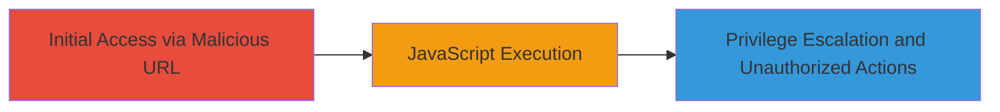

# Reflective XSS in SharePoint SiteName Parameter for Privilege Escalation

Multi-stage attack chain demonstrating a complete attack workflow.

## Chain Metrics Dashboard

| Metric | Value |
|--------|-------|
| Chain Status | Unverified |
| Total Steps | 1 |
| Execution Time | ~1 minutes |
| Skill Level | Intermediate |
| Complexity | Low |
| Impact Level | High |

## Attack Flow Visualization



## Prerequisites & Requirements

### Required Tools

- None (browser or curl sufficient)

### Target Environment

- Microsoft SharePoint Foundation 2013 Service Pack 1
- Web platform with accessible SharePoint pages
- Required services/ports: HTTP/HTTPS on port 80/443
- Network access requirements: Ability to access the SharePoint site URL

### Initial Access Requirements

- Authenticated user credentials (low-privilege account)
- Direct network access to the SharePoint server
- No prior access needed beyond valid session

## Detailed Attack Procedures

### Step 1: Inject and Execute XSS Payload
procedure: [[procedures/Exploit-Reflective-XSS-in-SharePoint-SiteName]]

**Objective**: Craft and access a malicious URL to inject JavaScript via the SiteName parameter, triggering execution for alert confirmation and potential privilege escalation.

**Instructions**: Construct the vulnerable URL by appending the encoded XSS payload to the SiteName parameter. Use a browser or curl to access it, ensuring an authenticated session.

For verification, access the URL with the payload:

```bash
curl "https://target-site.com/Pages/default.aspx?FollowSite=0&SiteName=%27-confirm(%27XSSALERT%27)-%27" -b "cookies.txt"
```

Or navigate directly in a browser while logged in.

**Expected Output**: The page loads and executes the JavaScript, displaying a confirm dialog with "XSSALERT". In a real exploit, this could be replaced with malicious code for data theft or actions.

**Success Indicators**:
- Confirm dialog appears with the payload message
- JavaScript executes without errors in browser console
- Potential for further actions like reading unauthorized content or modifying permissions

## Attack Chain Summary

### Key Achievements

1. Successful injection and execution of arbitrary JavaScript via reflected parameter
2. Demonstration of privilege escalation potential for authenticated attackers
3. Ability to impersonate users, delete content, or inject persistent scripts

## Technique & Tactic Coverage

### MITRE ATT&CK Techniques

- [[Exploit Public-Facing Application]]
- [[JavaScript]]

### MITRE ATT&CK Tactics

- [[Initial Access]]
- [[Execution]]
- [[Privilege Escalation]]

---
*Last updated: 2023-10-01T00:00:00Z*
