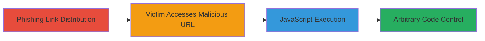

---
tags:
  - xss
  - reflective-xss
  - shopify
  - javascript
  - phishing
type: attack_chain
tools:
  - '[[tools/Mozilla-Firefox]]'
tactics:
  - '[[Initial Access]]'
  - '[[Execution]]'
commands: []
platforms:
  - Web
complexity: low
procedures:
  - '[[procedures/Exploit-Reflective-XSS-in-URL-Path]]'
step_count: 1
techniques:
  - '[[Exploit Public-Facing Application]]'
  - '[[JavaScript]]'
description: >-
  A single-stage attack exploiting a reflective XSS vulnerability in the URL
  path of wholesale.shopify.com to execute arbitrary JavaScript in the victim's
  browser.
skill_level: beginner
impact_level: high
id: 0b2a4b49-3ca6-44ec-a675-9d884f2a03de
created_at: '2025-12-14T03:46:37.952Z'
updated_at: '2025-12-14T03:46:37.952Z'
verified: false
validated: true
submitted: true
mitre_tactics:
  - '[[Initial Access]]'
  - '[[Execution]]'
mitre_techniques:
  - '[[Exploit Public-Facing Application]]'
  - '[[JavaScript]]'
---
# Reflective XSS on Shopify Wholesale via Malicious URL

## Overview

This attack chain demonstrates a reflective Cross-Site Scripting (XSS) vulnerability on wholesale.shopify.com, where user input from the URL path is directly reflected into a JavaScript context without proper encoding of quotes, double quotes, or angle brackets. An attacker crafts a malicious URL with a JavaScript payload, such as `asd';alert('XSS');'`, URL-encodes it, and distributes it via phishing links. When a victim accesses the URL in their browser, the payload executes, popping an alert box and potentially allowing arbitrary JavaScript execution. This can lead to session hijacking, data theft, or redirection to malicious sites, abusing the trust in the Shopify domain.

## Chain Metrics Dashboard

| Metric | Value |
|--------|-------|
| Chain Status | Unverified |
| Total Steps | 1 |
| Execution Time | ~1 minute |
| Skill Level | Beginner |
| Complexity | Low |
| Impact Level | High |

## Attack Flow Visualization

## Prerequisites & Requirements

### Required Tools

- [[tools/Mozilla-Firefox]]

### Target Environment

- Web platform
- Publicly accessible URL: https://wholesale.shopify.com
- No specific services or ports required beyond standard HTTPS (443)

### Initial Access Requirements

- No credentials needed
- Victim must click a phishing link leading to the malicious URL
- Browser access to the internet

## Detailed Attack Procedures

### Step 1: Craft and Access Malicious URL
procedure: [[procedures/Exploit-Reflective-XSS-in-URL-Path]]

**Objective**: Exploit the reflective XSS by injecting a JavaScript payload into the URL path, causing it to execute in the victim's browser upon access.

**Instructions**: Construct the malicious URL by appending the payload `asd';alert('XSS');'` to the base path, URL-encoding special characters (e.g., `%27` for `'`, `%3B` for `;`, `%28` for `(`, `%29` for `)`). The full URL is `https://wholesale.shopify.com/asd%27%3Balert%28%27XSS%27%29%3B%27`. Open this URL in a web browser like Mozilla Firefox to trigger the payload. In a real attack, send this URL to victims via phishing emails or messages.

**Expected Output**: An alert box displaying 'XSS' pops up in the browser, confirming JavaScript execution.

**Success Indicators**:
- Alert box appears with the payload message
- Browser console shows no errors, and the script executes without sanitization
- Victim's session is potentially compromised for further actions like data exfiltration

## Attack Chain Summary

### Key Achievements

1. Successful injection and execution of arbitrary JavaScript via URL reflection
2. Demonstration of domain trust abuse for phishing and redirection attacks
3. Potential for chaining with other exploits like session theft or malware delivery

## Technique & Tactic Coverage

### MITRE ATT&CK Techniques

- [[Exploit Public-Facing Application]]
- [[JavaScript]]

### MITRE ATT&CK Tactics

- [[Initial Access]]
- [[Execution]]

---
*Last updated: 2023-10-01*
