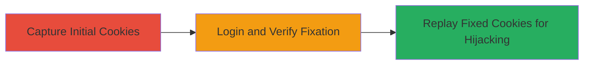

---
tags:
  - session-fixation
  - session-hijacking
  - web-vulnerability
  - cookies
  - xsrf
type: attack_chain
tools: []
tactics:
  - '[[Initial Access]]'
verified: false
platforms:
  - Web
submitted: true
complexity: medium
created_at: '2024-01-01T00:00:00Z'
procedures:
  - '[[procedures/Exploit-RelateIQ-Session-Fixation]]'
step_count: 3
techniques:
  - '[[Steal Web Session Cookie]]'
  - '[[Exploit Public-Facing Application]]'
updated_at: '2025-12-14T17:27:23.494Z'
description: >-
  Multi-stage attack exploiting session fixation in RelateIQ web application by
  reusing JSESSIONID and XSRF-TOKEN cookies before and after login to hijack
  user sessions.
skill_level: intermediate
impact_level: high
id: 33fb5106-3012-4c86-8cbc-4749f3935529
validated: true
mitre_tactics:
  - '[[Initial Access]]'
mitre_techniques:
  - '[[Steal Web Session Cookie]]'
  - '[[Exploit Public-Facing Application]]'
---
# RelateIQ Session Fixation Leading to Account Hijacking

Multi-stage attack chain demonstrating session fixation exploitation in the RelateIQ web application, where JSESSIONID and XSRF-TOKEN cookies remain unchanged post-login, allowing attackers to pre-set and replay these values for unauthorized account access.

## Chain Metrics Dashboard

| Metric | Value |
|--------|-------|
| Chain Status | Unverified |
| Total Steps | 3 |
| Execution Time | ~5 minutes |
| Skill Level | Intermediate |
| Complexity | Medium |
| Impact Level | High |

## Attack Flow Visualization

## Prerequisites & Requirements

### Required Tools

- [[tools/Burp-Suite]] (for intercepting HTTP requests)

### Target Environment

- Web application (RelateIQ)
- Java-based tech stack
- Access to login endpoint

### Initial Access Requirements

- Network access to the target web app
- No prior credentials needed for observation, but victim login required for hijacking
- Ability to intercept traffic (e.g., via proxy)

## Detailed Attack Procedures

### Step 1: Capture Initial Cookies
procedure: [[procedures/Exploit-RelateIQ-Session-Fixation]]

**Objective**: Intercept HTTP requests before login to capture initial JSESSIONID and XSRF-TOKEN cookie values.

**Instructions**: Configure a proxy tool like Burp Suite to intercept traffic to the RelateIQ login page. Navigate to the login endpoint and observe the cookies in the request headers.

**Expected Output**: Initial cookie values, e.g., JSESSIONID=somevalue and XSRF-TOKEN=someothervalue.

**Success Indicators**:
- Cookies captured without errors
- No authentication required at this stage

### Step 2: Verify Cookie Persistence Post-Login
procedure: [[procedures/Exploit-RelateIQ-Session-Fixation]]

**Objective**: Perform login and confirm that cookie values remain unchanged after authentication.

**Instructions**: With the proxy still active, submit login credentials (use test or victim credentials). Intercept the post-login requests and compare cookie values to the initial ones. For example, note if JSESSIONID=m8u0pm8mjvckm1ya8da4oqlfb0pd34iw38lr and XSRF-TOKEN=6B025F41D13BC02E9D658409BAC23F84 persist.

**Expected Output**: Identical cookie values before and after login, confirming the fixation vulnerability.

**Success Indicators**:
- Cookies unchanged post-authentication
- Successful login without session regeneration

### Step 3: Replay Fixed Cookies for Session Hijacking
procedure: [[procedures/Exploit-RelateIQ-Session-Fixation]]

**Objective**: Pre-set fixed cookie values and replay them after victim login to hijack the session.

**Instructions**: Set the captured JSESSIONID and XSRF-TOKEN in your browser or proxy before the victim logs in. Once the victim authenticates, replay these cookies in subsequent requests to the application.

**Expected Output**: Access to the victim's authenticated session, including account data and actions.

**Success Indicators**:
- Unauthorized access granted
- Session hijacked without additional credentials

## Attack Chain Summary

### Key Achievements

1. Identified session fixation vulnerability through cookie observation
2. Confirmed lack of token regeneration on login
3. Demonstrated full session hijacking for account takeover

## Technique & Tactic Coverage

### MITRE ATT&CK Techniques

- [[Steal Web Session Cookie]] Steal Web Session Cookie
- [[Exploit Public-Facing Application]] Exploit Public-Facing Application

### MITRE ATT&CK Tactics

- [[Initial Access]] Initial Access

---

*Last updated: 2024-01-01T00:00:00Z*
